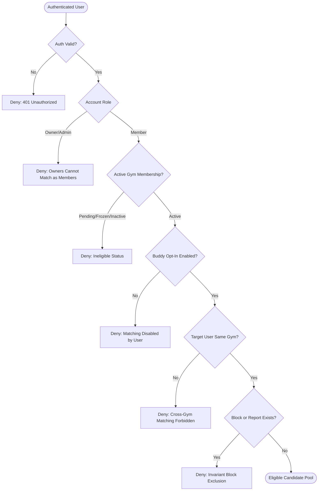
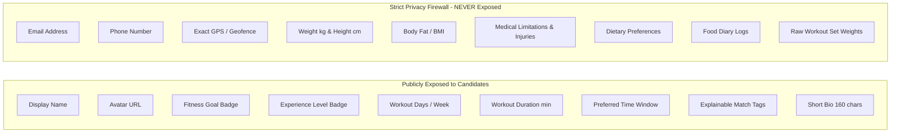
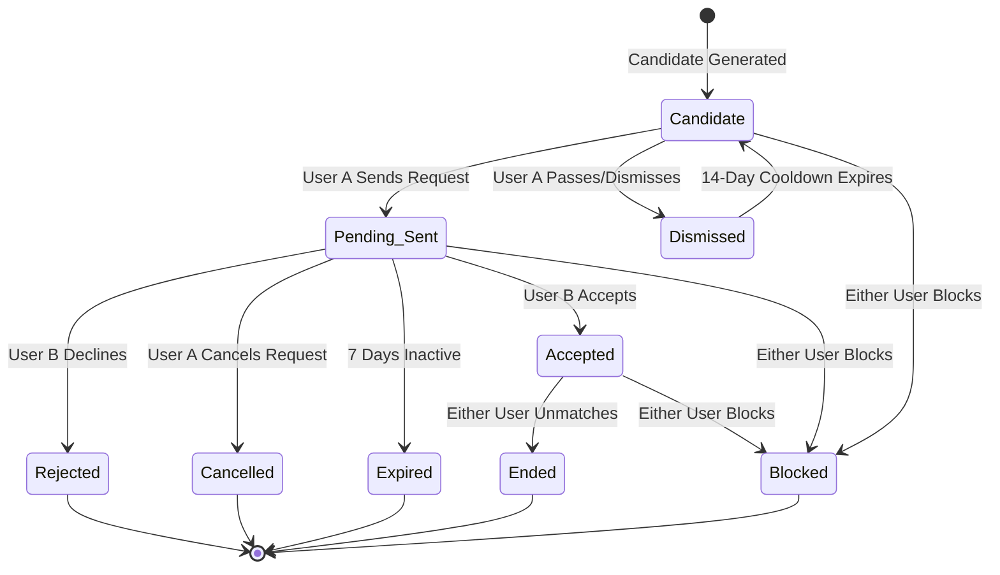

# Phase G3 — Dynamic Gym Buddy Matching
## Forensic R&D Audit & Technical Specification

**Date:** September 19, 2026  
**Phase:** G3 — Dynamic Gym Buddy Matching  
**Scope Status:** Forensic Audit Only (No Implementation Code / No Migrations / No DB Changes / No Deployment)  
**Parent Phases:**  
* Phase C1–C7: Member Gym Integration & Core Attendance Sessions (Live)  
* Phase G1: Gym Retention Foundation (Live)  
* Phase G2: Gym Community & Moderation (Live)  

---

## Executive Summary

Phase G3 introduces peer-to-peer athletic compatibility and buddy matching within verified FitBoost partner facilities. The objective is to connect active members who train at the same physical gym, share compatible fitness goals, align on training schedules, and maintain similar workout frequencies—fostering accountability and training retention.

This forensic audit evaluates all existing profile, biometric, membership, and community data structures in the FitBoost repository. It establishes a privacy-preserving, server-authoritative, deterministic matching engine (with **zero** dependence on non-deterministic AI/LLMs), defines a symmetric mutual-handshake lifecycle, details multi-tenant security and anti-abuse safeguards, and lays a clean foundation for Phase G4 Personal Chat.

---

## 1. Existing Data Inventory & Signal Classification

Every existing member, profile, fitness, and gym data structure across the database and codebase was audited for buddy matching utility:

| Signal / Field | Source Table & Column | Availability | Audit Classification | Architectural Assessment & Privacy Impact |
| :--- | :--- | :--- | :--- | :--- |
| **Fitness Goal** | `public.fitness_profiles.goal` | `'muscle_gain'`, `'fat_loss'`, `'maintenance'`, `'strength'`, `'endurance'` | **EXISTS** | **High Utility (Core Match Signal).** Strongly indicates training compatibility. Safe to display as an explainable tag. |
| **Experience Level** | `public.fitness_profiles.experience_level` | `'beginner'`, `'intermediate'`, `'advanced'` | **EXISTS** | **High Utility (Core Match Signal).** Prevents severe mismatches (e.g., beginner paired with competitive powerlifter without mutual desire). |
| **Days Per Week** | `public.fitness_profiles.days_per_week` | `INT (1..7)` | **EXISTS** | **High Utility (Core Match Signal).** Frequency alignment is critical for workout partner consistency. |
| **Workout Duration** | `public.fitness_profiles.workout_duration_minutes` | `INT (15..180)` | **EXISTS** | **Medium Utility.** Compatible session lengths (e.g. 45 min vs 60 min) prevent mid-workout friction. |
| **Workout Environment** | `public.fitness_profiles.workout_environment` | `'connected_gym'`, `'external_gym'`, `'home_equipped'`, `'home_bodyweight'` | **EXISTS** | **Hard Filter.** Only athletes whose environment is `'connected_gym'` and who hold an active partner gym membership qualify. |
| **Equipment** | `public.fitness_profiles.equipment` | `TEXT[]` (`'Barbell'`, `'Dumbbells'`, `'Cable'`, `'Machines'`, `'Bodyweight'`) | **EXISTS** | **Low Utility for In-Gym.** Integrated partner facilities already supply standard gym equipment. Can serve as soft tie-breaker. |
| **Limitations / Injuries** | `public.fitness_profiles.limitations` | `TEXT[]` (`'lower back'`, `'knees'`, `'shoulders'`, `'wrists'`, `'none'`) | **EXISTS** | **SHOULD NOT BE USED / EXPOSED.** Sensitive medical/orthopedic health data. Must NEVER be broadcast to prospective gym buddies. |
| **Age** | `public.fitness_profiles.age` | `INT (13..100)` | **EXISTS** | **SHOULD NOT BE USED DIRECTLY.** Exact chronological age risk shifting the product toward a dating app dynamic. If utilized, must be strictly age-bracketed (e.g., 20–29, 30–39) or entirely omitted. |
| **Height / Weight / BMI** | `public.fitness_profiles.height_cm`, `weight_kg` | `NUMERIC(5,2)` | **EXISTS** | **SHOULD NOT BE USED / EXPOSED.** Highly sensitive personal biometrics. Irrelevant for training partner compatibility; exposes users to judgment or harassment. |
| **Gender** | `public.fitness_profiles.gender` | `'male'`, `'female'`, `'other'` | **EXISTS** | **PARTIAL (Optional Filter Only).** Should NOT be used automatically to restrict matches, but may serve as an optional member safety preference (e.g., "prefer same-gender workout partners"). |
| **Preferred Training Time** | `notifications.metadata` (workout reminders) | Stored as ad-hoc `time: 'HH:MM'` for notifications only | **PARTIAL** | **High Utility but Missing from Profile.** Reminder time exists only for users who configure alarms. A dedicated buddy schedule preference (`morning`, `afternoon`, `evening`, `late_night`) is needed. |
| **Training Split** | `workout_plans.split_type` | `'Push / Pull / Legs'`, `'Upper / Lower'`, `'Full Body'` | **PARTIAL** | **Medium Utility.** Generated dynamically by the workout engine, but not stored as an explicit member preference on `fitness_profiles`. |
| **Dietary Preference** | `public.fitness_profiles.dietary_preference` | `'vegetarian'`, `'vegan'`, `'eggetarian'`, `'non_vegetarian'` | **EXISTS** | **SHOULD NOT BE USED.** Nutrition and dietary choice is irrelevant to on-floor lifting compatibility. |
| **Timezone** | `profiles.timezone`, `gyms.timezone` | `TEXT` (e.g. `'Asia/Kolkata'`) | **EXISTS** | **Context Signal.** Informs facility operational hours, but partner gym location already anchors physical geography. |
| **Gym Attendance Patterns** | `gym_attendance_sessions`, `gym_attendance_streaks` | `check_in_at`, `duration_seconds`, day-of-week timestamps | **PARTIAL** | **Medium Utility (Historical).** Records actual floor attendance, but represents retrospective data rather than declared forward availability. |
| **Community Activity** | `gym_posts`, `gym_comments` | G2 community tables | **EXISTS** | **SHOULD NOT BE USED.** Quiet or introverted members must not be penalized with lower match scores. |

---

## 2. Matching Eligibility Model

Matching eligibility requires strict server-authoritative validation across authentication, gym affiliation, membership standing, and privacy preferences:



### Strict Eligibility Matrix

| Account / Membership Status | Context Mode | Can View Candidates? | Can Appear in Candidate Feed? | Can Send / Receive Requests? |
| :--- | :--- | :--- | :--- | :--- |
| **Active Member** (`status = 'active'`) + Opt-In `true` | `integrated` | **YES** | **YES** | **YES** |
| **Active Member** (`status = 'active'`) + Opt-In `false` | `integrated` | **NO** (Prompt to opt in) | **NO** (Hidden from all) | **NO** |
| **Frozen Member** (`status = 'frozen'`) | `home` / `non_integrated` | **NO** (Suspended) | **NO** (Hidden from all) | **NO** |
| **Pending Member** (`status = 'pending'`) | `home` / `non_integrated` | **NO** | **NO** | **NO** |
| **Inactive / Cancelled** (`status = 'inactive'`) | `home` / `non_integrated` | **NO** | **NO** | **NO** |
| **Non-Integrated Athlete** (`home` / `external_gym`) | `home` / `non_integrated` | **NO** | **NO** | **NO** |
| **Facility Owner** (`account_role = 'gym_owner'`) | Owner Console | **NO** | **NO** | **NO** |
| **Member of Multiple Gyms** | Active Gym Context | **YES (Scoped to Active Gym Only)** | **YES (Scoped to Active Gym Only)** | **YES (Scoped to Active Gym Only)** |

---

## 3. Privacy & Opt-In Architecture

### A. Current Profile Model Audit
The existing `public.profiles` and `public.fitness_profiles` tables contain **zero** fields for buddy matching opt-in, buddy discovery visibility, or training schedule preferences.

### B. Minimal Authoritative Schema Addition: `public.gym_buddy_preferences`
Rather than polluting `fitness_profiles` with social flags, a dedicated `gym_buddy_preferences` table is recommended:

```sql
CREATE TABLE IF NOT EXISTS public.gym_buddy_preferences (
    user_id UUID PRIMARY KEY REFERENCES public.profiles(id) ON DELETE CASCADE,
    gym_id UUID NOT NULL REFERENCES public.gyms(id) ON DELETE CASCADE,
    is_opted_in BOOLEAN DEFAULT FALSE NOT NULL,
    preferred_training_time TEXT DEFAULT 'evening' NOT NULL 
        CHECK (preferred_training_time IN ('early_morning', 'morning', 'afternoon', 'evening', 'night')),
    preferred_training_days INT[] DEFAULT '{1,3,5}' NOT NULL, -- 0=Sun, 1=Mon, ..., 6=Sat
    preferred_gender_filter TEXT DEFAULT 'any' NOT NULL 
        CHECK (preferred_gender_filter IN ('any', 'same_gender')),
    bio_note TEXT CHECK (bio_note IS NULL OR char_length(bio_note) <= 160),
    created_at TIMESTAMPTZ DEFAULT NOW() NOT NULL,
    updated_at TIMESTAMPTZ DEFAULT NOW() NOT NULL,
    CONSTRAINT uq_buddy_pref_user_gym UNIQUE (user_id, gym_id)
);
```

### C. Default Opt-In & Opt-Out Invariants
1. **Privacy-by-Default (Opt-In Required):** `is_opted_in` defaults to `FALSE`. A member is never visible to other members until they explicitly enable buddy discovery.
2. **Instant Withdrawal (Opt-Out):** Setting `is_opted_in = FALSE` immediately:
   * Evicts the user from all candidate generation queries.
   * Cancels any outgoing pending requests.
   * Conceals their buddy card across the facility.
   * Preserves already existing `accepted` connections (with an indicator) or pauses them per user selection.

### D. Data Exposure Firewall



---

## 4. Deterministic Matching Engine

The matching engine is **100% deterministic, mathematically explainable, and reproducible**. It uses zero generative AI or non-deterministic LLM scoring.

### A. Hard Eligibility Filter (Boolean Gate)
A candidate pair $(U_A, U_B)$ qualifies for scoring **if and only if**:
$$\text{Eligible}(U_A, U_B) = 
\begin{cases} 
\text{TRUE} & \text{if } U_A \neq U_B \\
& \land \text{ ActiveGym}(U_A) = \text{ActiveGym}(U_B) \\
& \land \text{ ActiveMembership}(U_A) \land \text{ActiveMembership}(U_B) \\
& \land \text{ OptedIn}(U_A) \land \text{OptedIn}(U_B) \\
& \land \neg \text{Blocked}(U_A, U_B) \land \neg \text{Blocked}(U_B, U_A) \\
& \land \neg \text{ActiveConnection}(U_A, U_B) \\
& \land \neg \text{RecentlyDismissed}(U_A, U_B) \\
& \land \text{GenderFilterCompatible}(U_A, U_B) \\
\text{FALSE} & \text{otherwise}
\end{cases}$$

### B. Weighted Compatibility Score Formula (Max 100 Points)

The overall compatibility score $S(U_A, U_B) \in [0, 100]$ is computed from 5 orthogonal dimensions:

$$S(U_A, U_B) = S_{\text{schedule}} + S_{\text{goal}} + S_{\text{exp}} + S_{\text{duration}} + S_{\text{frequency}}$$

```
┌────────────────────────────────────────────────────────┐
│ COMPATIBILITY SCORE BREAKDOWN (100 PTS TOTAL)          │
├──────────────────────────┬────────┬────────────────────┤
│ 1. Schedule & Time       │ 30 pts │ Day/Time Overlap   │
│ 2. Fitness Goal          │ 25 pts │ Training Alignment │
│ 3. Experience Proximity  │ 20 pts │ Lifting Level      │
│ 4. Duration Proximity    │ 15 pts │ Session Length     │
│ 5. Frequency Proximity   │ 10 pts │ Days / Week        │
└──────────────────────────┴────────┴────────────────────┘
```

#### 1. Schedule & Training Time Overlap (30 Points)
* **Time-of-Day Window (18 pts):**
  * Exact match (e.g. both `morning`): **18 pts**
  * Adjacent window (e.g. `early_morning` and `morning`, or `afternoon` and `evening`): **9 pts**
  * Disparate window (e.g. `early_morning` vs `night`): **0 pts**
* **Day-of-Week Overlap (12 pts):**
  * Let $J = \frac{|Days_A \cap Days_B|}{|Days_A \cup Days_B|}$ (Jaccard similarity of preferred training days):
  * Points = $\text{round}(12 \times J)$ (e.g., 3 overlapping days out of 4 = 9 pts).

#### 2. Fitness Goal Alignment (25 Points)
* **Exact Goal Match (25 pts):**
  * `muscle_gain` $\leftrightarrow$ `muscle_gain`, `strength` $\leftrightarrow$ `strength`, `fat_loss` $\leftrightarrow$ `fat_loss`.
* **Highly Synergistic Goal Match (18 pts):**
  * `muscle_gain` $\leftrightarrow$ `strength`
  * `fat_loss` $\leftrightarrow$ `endurance`
  * `maintenance` $\leftrightarrow$ `muscle_gain` or `fat_loss`
* **Divergent Goals (8 pts):**
  * `strength` (heavy singles/doubles, 3–5 min rest) $\leftrightarrow$ `endurance` (circuits/high reps, 30s rest).

#### 3. Experience Level Proximity (20 Points)
* **Same Level (20 pts):**
  * `beginner` $\leftrightarrow$ `beginner`, `intermediate` $\leftrightarrow$ `intermediate`, `advanced` $\leftrightarrow$ `advanced`.
* **Adjacent Level (12 pts):**
  * `beginner` $\leftrightarrow$ `intermediate`
  * `intermediate` $\leftrightarrow$ `advanced`
* **Disparate Level (4 pts):**
  * `beginner` $\leftrightarrow$ `advanced` (drastically differing intensity, spotting requirements, and pacing).

#### 4. Workout Duration Proximity (15 Points)
Let $\Delta D = |Duration_A - Duration_B|$ in minutes:
* $\Delta D \le 15 \text{ min}$: **15 pts**
* $15 < \Delta D \le 30 \text{ min}$: **10 pts**
* $30 < \Delta D \le 45 \text{ min}$: **5 pts**
* $\Delta D > 45 \text{ min}$: **0 pts**

#### 5. Frequency Proximity (10 Points)
Let $\Delta F = |DaysPerWeek_A - DaysPerWeek_B|$:
* $\Delta F = 0$: **10 pts**
* $\Delta F = 1$: **7 pts**
* $\Delta F = 2$: **4 pts**
* $\Delta F \ge 3$: **0 pts**

### C. Threshold, Tie-Breaking & Explainability
* **Minimum Threshold:** Candidates must score $\ge 40$ points to appear in the "Recommended Buddies" feed.
* **Tie-Breaking Rule:** Strictly deterministic ordering:
  `ORDER BY compatibility_score DESC, preferred_training_days_overlap DESC, candidate_user_id ASC`
* **Human-Readable Badges (Explainable Tags):**
  Every candidate card displays calculated badges:
  * 🎯 **"Same Goal: Muscle Gain"** (if goal match)
  * 🌅 **"Morning Crew (06:00–10:00)"** (if time window match)
  * 📅 **"3 Overlapping Days"** (Mon, Wed, Fri)
  * ⏱️ **"Similar Pace (60 min)"**
  * ⚡ **"Fellow Intermediate"**

---

## 5. Match Result & Connection Lifecycle

Buddy matching requires a symmetric connection model that prevents duplicate or conflicting records.

### Symmetric Pair Normalization Rule
To prevent duplicate state rows $(U_A, U_B)$ and $(U_B, U_A)$, the connection table enforces a canonical ordering invariant:
$$\text{user\_a\_id} < \text{user\_b\_id}$$



### Lifecycle State Definitions

| State | Initiator | Target State Meaning | Actions Available |
| :--- | :--- | :--- | :--- |
| **`candidate`** | System | Unseen or browsed candidate in feed. | Send Request, Pass (Dismiss) |
| **`pending`** | Sender | Sender expressed interest; awaiting receiver action. | Receiver: Accept, Decline; Sender: Cancel |
| **`accepted`** | Receiver | Mutual handshake achieved. Active gym buddy status. | View Details, Plan Session, Unmatch, Block |
| **`declined`** | Receiver | Target declined request. | Hidden from feed; no further requests for 30 days |
| **`cancelled`** | Sender | Sender revoked outgoing request before response. | Resets interaction |
| **`ended`** | Either | Either member unpartnered. | Disconnects buddy status cleanly |
| **`blocked`** | Either | Mutual hard block. Total invisibility in all feeds. | Unblock (via settings only) |

---

## 6. Proposed Schema Specifications

### Table 1: `public.gym_buddy_preferences`
Tracks member opt-in, schedule preferences, and public profile bio.

```sql
CREATE TABLE IF NOT EXISTS public.gym_buddy_preferences (
    user_id UUID PRIMARY KEY REFERENCES public.profiles(id) ON DELETE CASCADE,
    gym_id UUID NOT NULL REFERENCES public.gyms(id) ON DELETE CASCADE,
    is_opted_in BOOLEAN DEFAULT FALSE NOT NULL,
    preferred_training_time TEXT DEFAULT 'evening' NOT NULL 
        CHECK (preferred_training_time IN ('early_morning', 'morning', 'afternoon', 'evening', 'night')),
    preferred_training_days INT[] DEFAULT '{1,3,5}' NOT NULL,
    preferred_gender_filter TEXT DEFAULT 'any' NOT NULL 
        CHECK (preferred_gender_filter IN ('any', 'same_gender')),
    bio_note TEXT CHECK (bio_note IS NULL OR char_length(bio_note) <= 160),
    created_at TIMESTAMPTZ DEFAULT NOW() NOT NULL,
    updated_at TIMESTAMPTZ DEFAULT NOW() NOT NULL
);

CREATE INDEX IF NOT EXISTS idx_gym_buddy_prefs_lookup
ON public.gym_buddy_preferences (gym_id, is_opted_in);
```

### Table 2: `public.gym_buddy_connections`
Manages the authoritative connection lifecycle between two athletes.

```sql
CREATE TABLE IF NOT EXISTS public.gym_buddy_connections (
    id UUID PRIMARY KEY DEFAULT gen_random_uuid(),
    gym_id UUID NOT NULL REFERENCES public.gyms(id) ON DELETE CASCADE,
    user_a_id UUID NOT NULL REFERENCES public.profiles(id) ON DELETE CASCADE,
    user_b_id UUID NOT NULL REFERENCES public.profiles(id) ON DELETE CASCADE,
    requester_id UUID NOT NULL REFERENCES public.profiles(id) ON DELETE CASCADE,
    status TEXT DEFAULT 'pending' NOT NULL 
        CHECK (status IN ('pending', 'accepted', 'declined', 'cancelled', 'ended', 'blocked')),
    compatibility_score INT CHECK (compatibility_score BETWEEN 0 AND 100),
    match_reasons JSONB DEFAULT '[]'::JSONB NOT NULL,
    accepted_at TIMESTAMPTZ,
    ended_at TIMESTAMPTZ,
    blocked_by UUID REFERENCES public.profiles(id) ON DELETE SET NULL,
    created_at TIMESTAMPTZ DEFAULT NOW() NOT NULL,
    updated_at TIMESTAMPTZ DEFAULT NOW() NOT NULL,
    CONSTRAINT chk_canonical_user_order CHECK (user_a_id < user_b_id),
    CONSTRAINT chk_requester_is_participant CHECK (requester_id = user_a_id OR requester_id = user_b_id),
    CONSTRAINT uq_buddy_connection_pair UNIQUE (gym_id, user_a_id, user_b_id)
);

CREATE INDEX IF NOT EXISTS idx_gym_buddy_conn_user_a ON public.gym_buddy_connections (user_a_id, status);
CREATE INDEX IF NOT EXISTS idx_gym_buddy_conn_user_b ON public.gym_buddy_connections (user_b_id, status);
CREATE INDEX IF NOT EXISTS idx_gym_buddy_conn_gym ON public.gym_buddy_connections (gym_id, status);
```

### Table 3: `public.gym_buddy_dismissals`
Tracks passed/dismissed candidates so they do not immediately clutter the member's feed.

```sql
CREATE TABLE IF NOT EXISTS public.gym_buddy_dismissals (
    id UUID PRIMARY KEY DEFAULT gen_random_uuid(),
    user_id UUID NOT NULL REFERENCES public.profiles(id) ON DELETE CASCADE,
    dismissed_user_id UUID NOT NULL REFERENCES public.profiles(id) ON DELETE CASCADE,
    gym_id UUID NOT NULL REFERENCES public.gyms(id) ON DELETE CASCADE,
    dismissed_at TIMESTAMPTZ DEFAULT NOW() NOT NULL,
    expires_at TIMESTAMPTZ DEFAULT (NOW() + INTERVAL '14 days') NOT NULL,
    CONSTRAINT uq_buddy_dismissal UNIQUE (user_id, dismissed_user_id, gym_id),
    CONSTRAINT chk_no_self_dismissal CHECK (user_id != dismissed_user_id)
);

CREATE INDEX IF NOT EXISTS idx_gym_buddy_dismissals_active
ON public.gym_buddy_dismissals (user_id, gym_id, expires_at);
```

---

## 7. Row-Level Security (RLS) & Security Architecture

### A. RLS Isolation Invariants
1. **Participant-Only Access:** A user can only inspect connection records where `auth.uid() = user_a_id OR auth.uid() = user_b_id`.
2. **Authoritative Sender Enforcement:** A user cannot forge a connection where `requester_id != auth.uid()`.
3. **No Cross-Gym Connection Creation:** `gym_id` must match the caller's active gym membership in `public.gym_memberships`.
4. **Owner Separation Invariant:** Facility owners have **zero** access to private member buddy connections. Buddy matching is strictly peer-to-peer among gym athletes.

### B. Required Policies Preview

```sql
-- 1. GYM BUDDY PREFERENCES
ALTER TABLE public.gym_buddy_preferences ENABLE ROW LEVEL SECURITY;

-- Members can manage their own preferences
CREATE POLICY "Users manage own buddy preferences"
ON public.gym_buddy_preferences FOR ALL
TO authenticated
USING (user_id = auth.uid())
WITH CHECK (user_id = auth.uid());

-- Active gym members can read preferences of opted-in members at the same gym
CREATE POLICY "Active members view opted-in peer preferences"
ON public.gym_buddy_preferences FOR SELECT
TO authenticated
USING (
    is_opted_in = TRUE
    AND EXISTS (
        SELECT 1 FROM public.gym_memberships m
        WHERE m.gym_id = gym_buddy_preferences.gym_id
          AND m.user_id = auth.uid()
          AND m.status = 'active'
    )
);

-- 2. GYM BUDDY CONNECTIONS
ALTER TABLE public.gym_buddy_connections ENABLE ROW LEVEL SECURITY;

-- Participants view their own connections
CREATE POLICY "Participants view own buddy connections"
ON public.gym_buddy_connections FOR SELECT
TO authenticated
USING (user_a_id = auth.uid() OR user_b_id = auth.uid());

-- Only requester can insert a new pending connection
CREATE POLICY "Requesters create pending connections"
ON public.gym_buddy_connections FOR INSERT
TO authenticated
WITH CHECK (
    requester_id = auth.uid()
    AND (user_a_id = auth.uid() OR user_b_id = auth.uid())
    AND status = 'pending'
    AND EXISTS (
        SELECT 1 FROM public.gym_memberships m
        WHERE m.gym_id = gym_buddy_connections.gym_id
          AND m.user_id = auth.uid()
          AND m.status = 'active'
    )
);

-- Participants can update their connection (accept, decline, cancel, end, block)
CREATE POLICY "Participants update own connection"
ON public.gym_buddy_connections FOR UPDATE
TO authenticated
USING (user_a_id = auth.uid() OR user_b_id = auth.uid())
WITH CHECK (user_a_id = auth.uid() OR user_b_id = auth.uid());
```

---

## 8. Abuse Prevention & Rate-Limiting Model

To prevent harassment, scraping, spamming, and dating-app behavior:

```
┌────────────────────────────────────────────────────────┐
│ ANTI-ABUSE & RATE-LIMITING CONTROLS                    │
├──────────────────────────┬─────────────────────────────┤
│ Pending Outgoing Requests│ Max 5 concurrent active     │
│ Daily Candidate Exposure │ Bounded batch (15 / day)    │
│ Request Expiration       │ Auto-expires after 7 days   │
│ Dismissal Cooldown       │ 14 days before resurfacing  │
│ Post-Decline Cooldown    │ 30 days before re-request   │
│ Free-Tier Connection Cap │ Max 3 active gym buddies    │
│ Premium Connection Cap   │ Unlimited active buddies    │
│ Immediate Block Action   │ Hard mutual invisibility    │
└──────────────────────────┴─────────────────────────────┘
```

1. **Max Concurrent Outgoing Requests:** A member cannot have more than **5 pending requests** awaiting responses. This stops spray-and-pray request spamming.
2. **Candidate Pool Throttling:** Candidates are served in bounded batches of 15 per refresh/day to prevent mass scraping of gym member directories.
3. **Mutual Handshake Guarantee:** Zero contact or chat can occur unless both users independently confirm the connection.
4. **Safety Flagging & Moderation:** If a member receives an offensive note or experiences harassment, the existing `public.gym_post_reports` or a dedicated buddy report trigger allows immediate reporting to facility administration.

---

## 9. Candidate Generation & Query Performance Strategy

### The Problem to Avoid
* Never load all gym members into the browser client.
* Never execute $O(N^2)$ cross-matching in React component state.
* Never maintain a stale precomputed $N \times N$ matrix in the database.

### The Solution: Server-Authoritative Candidate Generation RPC
A dedicated PostgreSQL function `get_gym_buddy_candidates(p_gym_id UUID, p_limit INT)` executes directly in PostgreSQL:

1. **Hard Filter via Joins:**
   * Selects `gym_buddy_preferences` WHERE `gym_id = p_gym_id AND is_opted_in = TRUE AND user_id != auth.uid()`.
   * Joins `gym_memberships` ensuring target `status = 'active'`.
   * Left-joins `gym_buddy_connections` to exclude any existing pair in `pending`, `accepted`, or `blocked` status.
   * Left-joins `gym_buddy_dismissals` to filter out candidates dismissed within the last 14 days.
   * Joins `fitness_profiles` for goal, experience, duration, frequency.
2. **In-Query Deterministic Scoring:**
   * Computes the 5-part score formula using pure SQL expressions.
3. **Paging & Ordering:**
   * `WHERE compatibility_score >= 40`
   * `ORDER BY compatibility_score DESC, p.created_at ASC`
   * `LIMIT p_limit` (default: 15).
4. **Execution Time:** Expected execution $< 15\text{ ms}$ with composite index `(gym_id, is_opted_in)` on `gym_buddy_preferences`.

---

## 10. Member UX Specification

### A. FitBoost Visual Design Language
* Conforms to the existing **Dark Graphite (`#0F1117`, `#1A1D27`) + Vibrant Blue (`#3B82F6`)** design system.
* **No Dating-App Gestures:** No swipe-left/swipe-right cards, no heart animations. Clean, professional athletic networking cards.

```
┌───────────────────────────────────────────────────────────────┐
│ FIND A GYM BUDDY — FITBOOST GYM (KORAMANGALA)                 │
├───────────────────────────────────────────────────────────────┤
│ [ Discover Buddies (12) ]      [ My Active Buddies (2) ]      │
├───────────────────────────────────────────────────────────────┤
│ ┌───────────────────────────────────────────────────────────┐ │
│ │ [Avatar]  Marcus K.                 ⚡ 88% Match          │ │
│ │           Member since June 2026                          │ │
│ │                                                           │ │
│ │ [🎯 Muscle Gain]  [🌅 Morning (07:00)]  [⏱️ 60 Min]       │ │
│ │ [⚡ Intermediate]  [📅 4 Days / Week (Mon, Wed, Fri, Sat)] │ │
│ │                                                           │ │
│ │ "Focusing on heavy compound lifts and hypertrophy.        │ │
│ │  Looking for a dedicated spotter on bench and squat days."│ │
│ │                                                           │ │
│ │ [ Connect / Send Request ]            [ Pass for Now ]    │ │
│ └───────────────────────────────────────────────────────────┘ │
└───────────────────────────────────────────────────────────────┘
```

### B. Navigation & Entry Points
1. **Primary Entry:** Member Gym Hub (`/app/gym`) $\rightarrow$ Quick action tab `"Gym Buddies"`.
2. **Dedicated Route:** `/app/gym/buddies`.
3. **Opt-In State Handling:**
   * If not opted in: Shows clean value proposition banner: *"Find training partners at your gym who lift at your pace and time."* with an `"Enable Buddy Matching"` toggle.
   * Once opted in: Displays the Discover feed and Active Buddies tabs.

---

## 11. Future Chat Compatibility (Phase G4 Preparation)

Phase G3 builds the exact structural prerequisites for Phase G4 Personal Chat:

```
Phase G3: Dynamic Buddy Matching
  └── Identifies compatible athletes
  └── Establishes verified mutual handshake
  └── Generates stable Connection ID: UUID
        │
        ▼
Phase G4: Personal Chat
  └── 1-to-1 conversation keyed by gym_buddy_connections.id
  └── Participants: user_a_id and user_b_id
  └── Gated by invariant: status = 'accepted'
  └── Instantly blocked if connection status changes to 'ended' or 'blocked'
```

* **Stable Relationship Primary Key:** `gym_buddy_connections.id` serves as the future `conversation_id`.
* **Zero Chat Leakage:** No chat UI or messaging tables are built in G3. Only the authenticated connection relationship is established.

---

## 12. Comprehensive Test Matrix

Before G3 implementation begins, the following test scenarios must be codified:

```
┌────────────────────────────────────────────────────────┐
│ PHASE G3 VERIFICATION & TEST MATRIX                    │
├────────────────────────────┬───────────────────────────┤
│ 1. Eligibility Suite       │ 6 Tests                   │
│ 2. Deterministic Scoring   │ 7 Tests                   │
│ 3. Privacy & Data Leaks    │ 5 Tests                   │
│ 4. Lifecycle & Transitions │ 8 Tests                   │
│ 5. Multi-Tenancy & RLS     │ 6 Tests                   │
│ 6. Anti-Abuse & Limits     │ 4 Tests                   │
│ 7. G4 Chat Contract Gating │ 2 Tests                   │
│ TOTAL PLANNED TESTS        │ 38 Tests                  │
└────────────────────────────┴───────────────────────────┘
```

### Detailed Test Specifications

1. **Eligibility Tests:**
   * Active member at Gym A can see opted-in candidates at Gym A.
   * Active member at Gym A cannot see candidates at Gym B.
   * Frozen member cannot view candidates or appear in candidate feeds.
   * Pending or Inactive member receives 403 Forbidden.
   * Non-integrated athlete (`home` or `external_gym`) is blocked from gym buddy matching.
   * Facility owner cannot participate in buddy matching as a member.

2. **Deterministic Scoring & Algorithm Tests:**
   * Exact match across all 5 dimensions outputs exactly `100` points.
   * Divergent schedule (Morning vs Night) and goals yields $< 40$ points and is excluded.
   * Identical input profiles produce identical score and identical tie-break order.
   * Symmetric scoring: `Score(A, B) == Score(B, A)` for all profile pairs.
   * Jaccard overlap correctly handles disjoint days and full-week lifters.

3. **Privacy & IDOR Defense Tests:**
   * `fitness_profiles.limitations` (medical data) is never returned in candidate payload.
   * `fitness_profiles.weight_kg` and `height_cm` are never returned in candidate payload.
   * Email, phone number, and GPS coordinates are strictly filtered out.
   * Member cannot inspect connection records of other members (`user_a != auth.uid() AND user_b != auth.uid()`).
   * Member cannot forge a request on behalf of another user (`requester_id != auth.uid()`).

4. **Lifecycle State Transition Tests:**
   * `candidate` $\rightarrow$ `pending` on send request.
   * `pending` $\rightarrow$ `accepted` on receiver accept.
   * `pending` $\rightarrow$ `declined` on receiver decline.
   * `pending` $\rightarrow$ `cancelled` on sender cancel.
   * `accepted` $\rightarrow$ `ended` on either member unmatch.
   * `accepted` or `pending` $\rightarrow$ `blocked` immediately suppresses both users mutually.

5. **Multi-Tenancy & Anti-Abuse Tests:**
   * Maximum 5 pending outgoing requests enforced; 6th request rejected.
   * Dismissed candidate does not reappear in candidate feed for 14 days.
   * Free-tier cap of 3 active buddies enforced authoritatively.

---

## 13. Product Decisions Requiring Explicit User Review

The following design decisions must be confirmed before implementation commences:

> [!IMPORTANT]
> **DECISION 1: Default Opt-In State**  
> *Option A (Recommended):* Explicit opt-in (`DEFAULT false`). User must actively enable matching. Maximizes privacy and prevents ghost profiles.  
> *Option B:* Automatic opt-in (`DEFAULT true`) for active gym members. Maximizes candidate density immediately.

> [!IMPORTANT]
> **DECISION 2: Training Time Granularity**  
> *Option A (Recommended):* 5 Broad Time Windows (`early_morning`, `morning`, `afternoon`, `evening`, `night`). Highly forgiving and compatible.  
> *Option B:* Exact HH:MM range selection. More precise, but causes false negatives if members arrive 30 minutes apart.

> [!IMPORTANT]
> **DECISION 3: Free vs. Premium Tier Buddy Quota**  
> *Option A (Recommended):* Free members can have up to 3 active gym buddies and 5 pending requests. Premium members have unlimited buddies.  
> *Option B:* Unlimited for all active members (relying strictly on physical gym membership for monetization).

> [!IMPORTANT]
> **DECISION 4: Age Display in Preview Card**  
> *Option A (Recommended):* Omit age entirely. Focus exclusively on goals, split, schedule, and experience. Avoids dating-app behavior.  
> *Option B:* Bracketed age group (e.g., "20s", "30s", "40s+").  
> *Option C:* Exact age number.

---

## 14. Recommended G3 Implementation Scope (4 Core Features)

To maintain architectural focus and avoid scope creep, Phase G3 should be restricted to **4 tightly scoped features**:

1. **Feature 1: Buddy Preferences & Opt-In (`gym_buddy_preferences`)**
   * Member toggle for buddy discovery.
   * Preferred training time window and day selection.
   * Short 160-character bio note.
2. **Feature 2: Deterministic Compatibility Engine & Candidate Feed RPC**
   * PostgreSQL stored procedure `get_gym_buddy_candidates`.
   * Pure domain TypeScript calculation mirror for instant UI updates.
   * 5-factor scoring formula with explainable badges.
3. **Feature 3: Mutual Handshake Connection Lifecycle (`gym_buddy_connections`)**
   * Request $\rightarrow$ Accept / Decline / Cancel lifecycle.
   * Symmetrical pair storage (`user_a_id < user_b_id`).
   * 14-day dismissal tracking (`gym_buddy_dismissals`).
4. **Feature 4: Member Buddy UI & Safety Controls**
   * Accessible at `/app/gym/buddies`.
   * Discover Candidates feed with explainable match badges.
   * My Active Buddies management (Unmatch, Block, Report).

---

## Audit Conclusion & Next Steps

* **Current Codebase State:** 600/600 tests passing; live production healthy; G2 community and moderation verified.
* **G3 Feasibility:** Highly feasible with zero breaking changes to existing G1/G2 tables.
* **Recommendation:** Await user review on Section 13 decisions before generating the formal technical implementation plan or writing code.

**STATUS: FORENSIC AUDIT COMPLETE. NO CODE WRITTEN. NO MIGRATIONS CREATED. STOPPING FOR USER REVIEW.**
