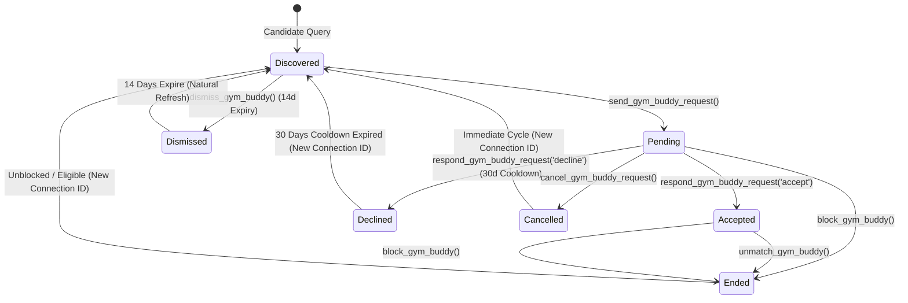
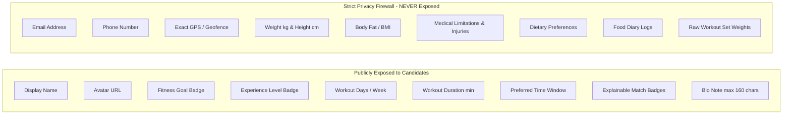

# Phase G3 — Dynamic Gym Buddy Matching
## Technical Implementation Plan & Architecture Specification (Final)

**Date:** September 19, 2026  
**Phase:** G3 — Dynamic Gym Buddy Matching  
**Scope Status:** Final Technical Implementation Plan (No Code / No Migrations / No DB Changes / No Deployment)  
**Parent Phases:**  
* Phase C1–C7: Member Gym Integration & Core Attendance Sessions (Production Live)  
* Phase G1: Gym Retention Foundation (Production Live)  
* Phase G2: Gym Community & Moderation (Production Live)  

---

## Executive Summary

Phase G3 delivers a server-authoritative, deterministic, and privacy-first workout buddy discovery and matching engine for FitBoost partner gym facilities. It enables verified active gym members to connect with compatible training partners based on schedule alignment, shared fitness goals, lifting experience, and session pacing—fostering attendance accountability and retention.

This revised specification incorporates all locked product rules, partial unique index lifecycle history retention, global user blocking semantics, whistleblower-protected conduct reporting, and strict G4 chat contract immutability.

---

## 1. Authoritative Schema Specification

The G3 data architecture introduces 5 dedicated tables in PostgreSQL:

```sql
-- ==============================================================================
-- 1. GYM BUDDY PREFERENCES TABLE
-- ==============================================================================
CREATE TABLE IF NOT EXISTS public.gym_buddy_preferences (
    user_id UUID NOT NULL REFERENCES public.profiles(id) ON DELETE CASCADE,
    gym_id UUID NOT NULL REFERENCES public.gyms(id) ON DELETE CASCADE,
    is_opted_in BOOLEAN DEFAULT FALSE NOT NULL,
    preferred_training_time TEXT DEFAULT 'evening' NOT NULL 
        CHECK (preferred_training_time IN ('early_morning', 'morning', 'afternoon', 'evening', 'night')),
    preferred_training_days INT[] DEFAULT '{1,2,3,4,5}' NOT NULL, -- 0=Sun, 1=Mon, ..., 6=Sat
    preferred_gender_filter TEXT DEFAULT 'any' NOT NULL 
        CHECK (preferred_gender_filter IN ('any', 'same_gender')),
    bio_note TEXT CHECK (bio_note IS NULL OR char_length(trim(bio_note)) <= 160),
    created_at TIMESTAMPTZ DEFAULT NOW() NOT NULL,
    updated_at TIMESTAMPTZ DEFAULT NOW() NOT NULL,
    PRIMARY KEY (user_id, gym_id)
);

-- ==============================================================================
-- 2. GYM BUDDY CONNECTIONS TABLE (Historical Lifecycle Model)
-- ==============================================================================
CREATE TABLE IF NOT EXISTS public.gym_buddy_connections (
    id UUID PRIMARY KEY DEFAULT gen_random_uuid(),
    gym_id UUID NOT NULL REFERENCES public.gyms(id) ON DELETE CASCADE,
    user_a_id UUID NOT NULL REFERENCES public.profiles(id) ON DELETE CASCADE,
    user_b_id UUID NOT NULL REFERENCES public.profiles(id) ON DELETE CASCADE,
    requester_id UUID NOT NULL REFERENCES public.profiles(id) ON DELETE CASCADE,
    status TEXT DEFAULT 'pending' NOT NULL 
        CHECK (status IN ('pending', 'accepted', 'declined', 'cancelled', 'ended')),
    compatibility_score INT CHECK (compatibility_score BETWEEN 0 AND 100),
    match_reasons JSONB DEFAULT '[]'::JSONB NOT NULL,
    accepted_at TIMESTAMPTZ,
    ended_at TIMESTAMPTZ,
    created_at TIMESTAMPTZ DEFAULT NOW() NOT NULL,
    updated_at TIMESTAMPTZ DEFAULT NOW() NOT NULL,
    -- Canonical order invariant: user_a_id < user_b_id
    CONSTRAINT chk_canonical_user_order CHECK (user_a_id < user_b_id),
    CONSTRAINT chk_requester_is_participant CHECK (requester_id = user_a_id OR requester_id = user_b_id)
);

-- ==============================================================================
-- 3. GYM BUDDY DISMISSALS TABLE (Cyclic Expiry)
-- ==============================================================================
CREATE TABLE IF NOT EXISTS public.gym_buddy_dismissals (
    id UUID PRIMARY KEY DEFAULT gen_random_uuid(),
    user_id UUID NOT NULL REFERENCES public.profiles(id) ON DELETE CASCADE,
    dismissed_user_id UUID NOT NULL REFERENCES public.profiles(id) ON DELETE CASCADE,
    gym_id UUID NOT NULL REFERENCES public.gyms(id) ON DELETE CASCADE,
    dismissed_at TIMESTAMPTZ DEFAULT NOW() NOT NULL,
    expires_at TIMESTAMPTZ DEFAULT (NOW() + INTERVAL '14 days') NOT NULL,
    CONSTRAINT uq_buddy_dismissal UNIQUE (user_id, dismissed_user_id, gym_id),
    CONSTRAINT chk_no_self_dismissal CHECK (user_id != dismissed_user_id)
);

-- ==============================================================================
-- 4. GYM BUDDY BLOCKS TABLE (Global User-to-User Safety — No gym_id)
-- ==============================================================================
CREATE TABLE IF NOT EXISTS public.gym_buddy_blocks (
    id UUID PRIMARY KEY DEFAULT gen_random_uuid(),
    blocker_id UUID NOT NULL REFERENCES public.profiles(id) ON DELETE CASCADE,
    blocked_id UUID NOT NULL REFERENCES public.profiles(id) ON DELETE CASCADE,
    created_at TIMESTAMPTZ DEFAULT NOW() NOT NULL,
    CONSTRAINT chk_no_self_block CHECK (blocker_id != blocked_id),
    CONSTRAINT uq_buddy_block_pair UNIQUE (blocker_id, blocked_id)
);

-- ==============================================================================
-- 5. GYM BUDDY REPORTS TABLE (Facility Owner Conduct Moderation)
-- ==============================================================================
CREATE TABLE IF NOT EXISTS public.gym_buddy_reports (
    id UUID PRIMARY KEY DEFAULT gen_random_uuid(),
    gym_id UUID NOT NULL REFERENCES public.gyms(id) ON DELETE CASCADE,
    reporter_id UUID NOT NULL REFERENCES public.profiles(id) ON DELETE CASCADE,
    reported_id UUID NOT NULL REFERENCES public.profiles(id) ON DELETE CASCADE,
    reason TEXT NOT NULL CHECK (reason IN ('harassment', 'inappropriate_behavior', 'unsolicited_contact', 'impersonation', 'spam', 'safety_concern', 'other')),
    details TEXT CHECK (details IS NULL OR char_length(trim(details)) <= 500),
    status TEXT DEFAULT 'pending' NOT NULL CHECK (status IN ('pending', 'reviewed', 'action_taken', 'dismissed')),
    reviewed_by UUID REFERENCES public.profiles(id) ON DELETE SET NULL,
    reviewed_at TIMESTAMPTZ,
    resolution_notes TEXT,
    created_at TIMESTAMPTZ DEFAULT NOW() NOT NULL,
    CONSTRAINT chk_no_self_report CHECK (reporter_id != reported_id),
    CONSTRAINT uq_buddy_report_once UNIQUE (reporter_id, reported_id, gym_id)
);
```

---

## 2. Indexes & Partial Unique Constraints

```sql
-- 1. PARTIAL UNIQUE INDEX: Exactly ONE active or pending relationship per pair per gym
-- Allows unlimited historical rows ('declined', 'cancelled', 'ended') while preventing concurrent duplicates
CREATE UNIQUE INDEX IF NOT EXISTS uq_buddy_connection_active 
ON public.gym_buddy_connections (gym_id, user_a_id, user_b_id) 
WHERE status IN ('pending', 'accepted');

-- 2. Connections Lookups & History
CREATE INDEX IF NOT EXISTS idx_buddy_conn_user_a ON public.gym_buddy_connections (user_a_id, status);
CREATE INDEX IF NOT EXISTS idx_buddy_conn_user_b ON public.gym_buddy_connections (user_b_id, status);
CREATE INDEX IF NOT EXISTS idx_buddy_conn_gym ON public.gym_buddy_connections (gym_id, status);
CREATE INDEX IF NOT EXISTS idx_buddy_conn_history ON public.gym_buddy_connections (gym_id, user_a_id, user_b_id, created_at DESC);

-- 3. Preferences Lookup
CREATE INDEX IF NOT EXISTS idx_gym_buddy_prefs_lookup ON public.gym_buddy_preferences (gym_id, is_opted_in);

-- 4. Active Dismissals Lookup (Filtered by expiration)
CREATE INDEX IF NOT EXISTS idx_buddy_dismissals_active ON public.gym_buddy_dismissals (user_id, gym_id, expires_at);

-- 5. Global Blocks Lookups
CREATE INDEX IF NOT EXISTS idx_buddy_blocks_blocker ON public.gym_buddy_blocks (blocker_id);
CREATE INDEX IF NOT EXISTS idx_buddy_blocks_blocked ON public.gym_buddy_blocks (blocked_id);

-- 6. Facility Conduct Reports Queue
CREATE INDEX IF NOT EXISTS idx_buddy_reports_gym ON public.gym_buddy_reports (gym_id, status, created_at DESC);
CREATE INDEX IF NOT EXISTS idx_buddy_reports_reporter ON public.gym_buddy_reports (reporter_id);
```

---

## 3. Authoritative Security Definer RPC Suite

All mutative actions are executed strictly through PostgreSQL stored procedures with fixed `search_path = public, auth`:

```
┌────────────────────────────────────────────────────────┐
│ AUTHORITATIVE STORED PROCEDURES (RPCs)                 │
├──────────────────────────┬─────────────────────────────┤
│ get_gym_buddy_candidates │ Bounded candidate feed      │
│ send_gym_buddy_request   │ Quota-checked request       │
│ respond_gym_buddy_request│ Accept or decline handshake │
│ cancel_gym_buddy_request │ Sender cancels pending      │
│ unmatch_gym_buddy        │ Safely ends connection      │
│ block_gym_buddy          │ Global block + cuts relation│
│ unblock_gym_buddy        │ Restores global visibility  │
│ report_gym_buddy         │ Owner conduct report        │
│ dismiss_gym_buddy        │ 14-day candidate hide upsert│
│ set_gym_buddy_opt_in     │ Toggles opt-in + auto-cancel│
└──────────────────────────┴─────────────────────────────┘
```

### 1. `get_gym_buddy_candidates(p_gym_id UUID, p_limit INT, p_cursor_score INT, p_cursor_user_id UUID)`
* Validates caller authentication (`auth.uid()`) and active membership at `p_gym_id`.
* Rejects facility owners (`account_role = 'gym_owner'`).
* Checks caller opt-in (`is_opted_in = true`).
* Server-side join excludes:
  - Users with mutual global blocks in `public.gym_buddy_blocks`.
  - Pairs with active/pending connections in `public.gym_buddy_connections`.
  - Candidates dismissed within the last 14 days in `public.gym_buddy_dismissals`.
  - Candidates who declined a request within the last 30 days.
  - Candidates incompatible with caller or peer gender filters.
* Computes deterministic 100-point compatibility score.
* Filters `score >= 40`.
* Paginates using keyset cursor: `(score < p_cursor_score) OR (score = p_cursor_score AND user_id > p_cursor_user_id)`.
* Orders by `score DESC, user_id ASC` with `LIMIT LEAST(p_limit, 20)`.

### 2. `send_gym_buddy_request(p_gym_id UUID, p_target_user_id UUID)`
* Validates active memberships at `p_gym_id`.
* Verifies no global block exists in either direction.
* Enforces **max 5 pending outgoing requests**:
  ```sql
  SELECT COUNT(*) INTO v_pending_count
  FROM public.gym_buddy_connections
  WHERE requester_id = v_caller_id AND status = 'pending';
  IF v_pending_count >= 5 THEN
      RAISE EXCEPTION 'PENDING_LIMIT_REACHED: Maximum 5 pending requests allowed';
  END IF;
  ```
* Enforces **Free Tier active buddy cap ($\le 3$)**:
  ```sql
  SELECT plan_type INTO v_caller_plan FROM public.profiles WHERE id = v_caller_id;
  IF v_caller_plan = 'free' THEN
      SELECT COUNT(*) INTO v_active_count
      FROM public.gym_buddy_connections
      WHERE (user_a_id = v_caller_id OR user_b_id = v_caller_id)
        AND status = 'accepted';
      IF v_active_count >= 3 THEN
          RAISE EXCEPTION 'FREE_TIER_LIMIT_REACHED: Free tier is limited to 3 active gym buddies';
      END IF;
  END IF;
  ```
* Inserts a **new connection row** with a brand new `id`, status `'pending'`. Partial index guarantees no active or pending row exists for this pair.

### 3. `respond_gym_buddy_request(p_connection_id UUID, p_action TEXT)`
* `p_action IN ('accept', 'decline')`.
* Verifies caller is the designated **receiver** (`requester_id != v_caller_id AND (user_a_id = v_caller_id OR user_b_id = v_caller_id)`).
* If `accept`:
  * Verifies receiver's Free tier entitlement (receiver cannot exceed 3 active buddies on Free tier).
  * Updates `status = 'accepted'`, `accepted_at = NOW()`.
* If `decline`:
  * Updates `status = 'declined'`, `updated_at = NOW()`. (Triggers 30-day cooldown in candidate query).

### 4. `cancel_gym_buddy_request(p_connection_id UUID)`
* Verifies caller is requester and status is `'pending'`.
* Updates `status = 'cancelled'`, `updated_at = NOW()`.

### 5. `unmatch_gym_buddy(p_connection_id UUID)`
* Verifies caller is participant (`user_a_id = v_caller_id OR user_b_id = v_caller_id`) and status is `'accepted'`.
* Updates `status = 'ended'`, `ended_at = NOW()`.
* Old `connection.id` is permanently preserved in historical records; future partnerships between them will generate a fresh ID.

### 6. `block_gym_buddy(p_target_user_id UUID)`
* Rejects self-block (`v_caller_id = p_target_user_id`).
* Inserts into `public.gym_buddy_blocks (blocker_id, blocked_id) ON CONFLICT DO NOTHING`.
* Immediately updates any existing `gym_buddy_connections` row with `status IN ('pending', 'accepted')` to `status = 'ended'`, `ended_at = NOW()`.

### 7. `unblock_gym_buddy(p_target_user_id UUID)`
* Deletes row from `public.gym_buddy_blocks WHERE blocker_id = v_caller_id AND blocked_id = p_target_user_id`.

### 8. `dismiss_gym_buddy(p_gym_id UUID, p_dismissed_user_id UUID)`
* Authoritative cyclic upsert with 14-day expiry refresh:
  ```sql
  INSERT INTO public.gym_buddy_dismissals (user_id, dismissed_user_id, gym_id, dismissed_at, expires_at)
  VALUES (v_caller_id, p_dismissed_user_id, p_gym_id, NOW(), NOW() + INTERVAL '14 days')
  ON CONFLICT (user_id, dismissed_user_id, gym_id)
  DO UPDATE SET dismissed_at = NOW(), expires_at = NOW() + INTERVAL '14 days';
  ```

### 9. `report_gym_buddy(p_gym_id UUID, p_reported_user_id UUID, p_reason TEXT, p_details TEXT)`
* Inserts into `public.gym_buddy_reports`.
* Conceals reporter from reported user. Does **not** auto-block.

### 10. `set_gym_buddy_opt_in(p_gym_id UUID, p_opt_in BOOLEAN)`
* Updates `gym_buddy_preferences.is_opted_in = p_opt_in`.
* If `p_opt_in = FALSE`:
  * Automatically sets all outgoing pending requests sent by caller to `'cancelled'`.
  * Leaves existing `accepted` buddy relationships intact.

---

## 4. Row-Level Security (RLS) Matrix

| Table | Cmd | Role | Policy Expression | Architectural Guarantee |
| :--- | :--- | :--- | :--- | :--- |
| `gym_buddy_preferences` | `SELECT` | `auth` | `user_id = auth.uid() OR (is_opted_in = TRUE AND EXISTS (SELECT 1 FROM gym_memberships WHERE gym_id = gym_buddy_preferences.gym_id AND user_id = auth.uid() AND status = 'active'))` | Own record or peer active member at same gym. |
| `gym_buddy_preferences` | `ALL` | `auth` | `user_id = auth.uid()` | Self-mutation only. |
| `gym_buddy_connections` | `SELECT` | `auth` | `user_a_id = auth.uid() OR user_b_id = auth.uid()` | Strict participant isolation. Gym owner has zero access. |
| `gym_buddy_connections` | `ALL` | `auth` | `user_a_id = auth.uid() OR user_b_id = auth.uid()` | Mutation gated by stored procedures. |
| `gym_buddy_dismissals` | `ALL` | `auth` | `user_id = auth.uid()` | Caller only. |
| `gym_buddy_blocks` | `SELECT` | `auth` | `blocker_id = auth.uid()` | Blocked user cannot inspect who blocked them. |
| `gym_buddy_blocks` | `INSERT/DELETE`| `auth` | `blocker_id = auth.uid()` | Self-mutation only. |
| `gym_buddy_reports` | `SELECT` | `auth` | `reporter_id = auth.uid() OR EXISTS (SELECT 1 FROM gyms WHERE id = gym_buddy_reports.gym_id AND owner_id = auth.uid())` | Reporter or Gym Owner. Reported user cannot read report. |
| `gym_buddy_reports` | `INSERT` | `auth` | `reporter_id = auth.uid()` | Reporter only. |

---

## 5. Global Block & Report Safety Architecture

```
┌────────────────────────────────────────────────────────┐
│ SAFETY TAXONOMY: BLOCK vs. REPORT                      │
├──────────────────────────┬─────────────────────────────┤
│ Dimension                │ Block (User Action)         │ Report (Facility Moderation)│
├──────────────────────────┼─────────────────────────────┼─────────────────────────────┤
│ Scope                    │ GLOBAL (All gyms)           │ Facility-Scoped (gym_id)    │
│ Target                   │ Peer member                 │ Gym Owner / Admin Review    │
│ Candidate Feed Impact    │ Immediate mutual exclusion  │ NO automatic suppression    │
│ Active Connection Impact │ Immediately ends connection │ Connection remains intact   │
│ Owner Visibility         │ Hidden (Zero owner access)  │ Visible to gym owner        │
│ Reported User Visibility │ Hidden                      │ Hidden (Whistleblower safe) │
│ Reversibility            │ User can unblock            │ Owner marks reviewed/taken  │
└──────────────────────────┴─────────────────────────────┘
```

1. **Global Block Semantics:**
   * User A blocking User B is stored globally without `gym_id`.
   * Both users are instantly filtered out of each other's candidate queries across all partner gyms.
   * Any existing pending or active connection between them transitions to `ended`.
   * Unblocking removes the block row; historical relationship rows remain intact.
2. **Report Semantics & Anti-Abuse:**
   * Reports are sent to the facility owner's moderation dashboard.
   * A report does **not** automatically suppress matching; malicious or retaliatory reports cannot be weaponized to manipulate candidate visibility.
   * The reporting member is offered an immediate 1-click option to block the user.
3. **Whistleblower Protection:**
   * The reported user receives **zero access** to view reports filed against them, preventing retaliation or intimidation.

---

## 6. Connection Lifecycle State Machine



---

## 7. Deterministic 100-Point Scoring Algorithm & Pseudocode

$$\text{Score}(U_A, U_B) = S_{\text{schedule}} (30) + S_{\text{goal}} (25) + S_{\text{exp}} (20) + S_{\text{duration}} (15) + S_{\text{frequency}} (10)$$

```python
def compute_compatibility_score(user_a, user_b):
    # 1. Schedule & Time Window (30 pts max)
    time_pts = 0
    if user_a.preferred_time == user_b.preferred_time:
        time_pts = 18
    elif is_adjacent_time(user_a.preferred_time, user_b.preferred_time):
        time_pts = 9
    
    # Jaccard day overlap: |A ∩ B| / |A ∪ B| * 12
    overlap_days = set(user_a.preferred_days).intersection(set(user_b.preferred_days))
    union_days = set(user_a.preferred_days).union(set(user_b.preferred_days))
    day_pts = round(12.0 * len(overlap_days) / len(union_days)) if union_days else 0
    schedule_score = time_pts + day_pts

    # 2. Fitness Goal (25 pts max)
    if user_a.goal == user_b.goal:
        goal_score = 25
    elif is_synergistic_goal(user_a.goal, user_b.goal):
        # (muscle_gain + strength, fat_loss + endurance, maintenance + muscle/fat)
        goal_score = 18
    else:
        goal_score = 8

    # 3. Experience Proximity (20 pts max)
    if user_a.experience_level == user_b.experience_level:
        exp_score = 20
    elif is_adjacent_experience(user_a.experience_level, user_b.experience_level):
        # (beginner + intermediate, intermediate + advanced)
        exp_score = 12
    else:
        # (beginner + advanced)
        exp_score = 4

    # 4. Workout Duration Proximity (15 pts max)
    delta_duration = abs(user_a.duration_minutes - user_b.duration_minutes)
    if delta_duration <= 15:
        duration_score = 15
    elif delta_duration <= 30:
        duration_score = 10
    elif delta_duration <= 45:
        duration_score = 5
    else:
        duration_score = 0

    # 5. Frequency Proximity (10 pts max)
    delta_days = abs(user_a.days_per_week - user_b.days_per_week)
    if delta_days == 0:
        freq_score = 10
    elif delta_days == 1:
        freq_score = 7
    elif delta_days == 2:
        freq_score = 4
    else:
        freq_score = 0

    total_score = schedule_score + goal_score + exp_score + duration_score + freq_score
    return total_score
```

---

## 8. Cooldown Logic & Quota Architecture

```
┌────────────────────────────────────────────────────────┐
│ COOLDOWNS & RATE-LIMITING CONTROLS                     │
├──────────────────────────┬─────────────────────────────┤
│ Pending Outgoing Requests│ Max 5 concurrent active     │
│ Dismissal Cooldown       │ 14 days before resurfacing  │
│ Post-Decline Cooldown    │ 30 days before re-request   │
│ Free-Tier Connection Cap │ Max 3 active gym buddies    │
│ Premium Connection Cap   │ Unlimited active buddies    │
│ Candidate Batch Limit    │ Max 20 candidates / page    │
└──────────────────────────┴─────────────────────────────┘
```

1. **Pending Request Cap:** Hard limit of 5 pending outgoing requests per user. Prevents spamming every member in the gym.
2. **Dismissal Cooldown:** Candidate dismissed via `dismiss_gym_buddy` is hidden for 14 days. After 14 days, the candidate naturally reappears if still eligible.
3. **Declined Cooldown:** If a request is declined, neither party can re-request or see each other in candidate feeds for 30 days (`updated_at > NOW() - INTERVAL '30 days'`).
4. **Authoritative Quota Enforcement:** Reuses `entitlementService.assertServerEntitlement()` and `public.profiles.plan_type` (`'free'` vs `'premium'`).

---

## 9. Privacy Rules & Data Exposure Firewall



---

## 10. Future G4 Chat Compatibility Contract

```
Phase G3: Dynamic Buddy Matching
  ├── Generates connection: gym_buddy_connections.id
  ├── Enforces canonical ordering: user_a_id < user_b_id
  └── Mutual handshake transitions status -> 'accepted'
        │
        ▼
Phase G4: Personal Chat
  ├── Conversation ID = gym_buddy_connections.id
  ├── Strict Gating: status = 'accepted'
  └── Severance Invariant: If status -> 'ended', chat insertion is instantly revoked
```

1. **No Connection ID Recycling:** If two users unmatch (`status = 'ended'`) and later re-partner, a brand new `gym_buddy_connections.id` is generated. Chat messages from the original partnership remain immutably anchored to the old ID.
2. **Gating Invariant:** In Phase G4, message dispatch will strictly require `status = 'accepted'` and neither user being in `gym_buddy_blocks`.

---

## 11. Comprehensive Test Matrix (42 Tests)

```
┌────────────────────────────────────────────────────────┐
│ PHASE G3 AUTOMATED TEST MATRIX (42 TOTAL TESTS)        │
├────────────────────────────┬───────────────────────────┤
│ 1. Preferences & Opt-In    │ 6 Tests                   │
│ 2. Eligibility Suite       │ 6 Tests                   │
│ 3. Deterministic Matching  │ 8 Tests                   │
│ 4. Safety (Block/Report)   │ 7 Tests                   │
│ 5. Connection Lifecycle    │ 8 Tests                   │
│ 6. Multi-Tenancy & RLS     │ 4 Tests                   │
│ 7. Rate Limits & Quotas    │ 3 Tests                   │
└────────────────────────────┴───────────────────────────┘
```

### Detailed Scenarios
1. **Preferences & Opt-In Suite (6 Tests):**
   * Default `is_opted_in` is `FALSE`.
   * Opt-in enables candidate feed visibility.
   * Opt-out immediately removes member from candidate query.
   * Opt-out auto-cancels pending outgoing requests.
   * Opt-out preserves existing `accepted` connections.
   * Gender filter (`same_gender`) restricts candidates bidirectionally.
2. **Eligibility Suite (6 Tests):**
   * Cross-gym matching rejected.
   * Frozen membership rejected.
   * Pending/inactive membership rejected.
   * Gym owner rejected from member matching.
   * Non-integrated athlete rejected.
   * Multi-gym member strictly scoped to active context.
3. **Deterministic Scoring Suite (8 Tests):**
   * 100 points awarded for identical 5 dimensions.
   * Jaccard day overlap calculation correctness (identical vs disjoint).
   * Exact vs synergistic vs divergent goal scoring.
   * Duration proximity scoring (15/10/5/0 min tiers).
   * Frequency proximity scoring (0/1/2/3 day diff tiers).
   * Score symmetry: `Score(A, B) == Score(B, A)`.
   * Deterministic tie-breaking: score DESC, user_id ASC.
   * Exclusion of scores $< 40$.
4. **Safety (Block & Report) Suite (7 Tests):**
   * Block creates global mutual invisibility without an existing connection.
   * Blocking an active buddy terminates connection to `ended`.
   * Unblocking restores visibility.
   * Report creates owner-visible audit row.
   * Reported user cannot inspect report or reporter identity.
   * Report does **not** automatically block candidate.
   * Reporter can block and report in tandem.
5. **Connection Lifecycle Suite (8 Tests):**
   * Partial unique index allows historical rows after unmatch.
   * New connection receives a brand new UUID.
   * Duplicate active/pending request rejected by partial unique index.
   * Receiver accept sets `accepted_at` and status `accepted`.
   * Receiver decline sets status `declined` with 30-day cooldown.
   * Requester cancel sets status `cancelled`.
   * Unmatch sets status `ended`.
   * Re-request after 30-day decline cooldown succeeds with new ID.
6. **Multi-Tenancy & RLS Suite (4 Tests):**
   * Member cannot inspect connections where they are not participant.
   * Gym owner cannot view private buddy connections.
   * Gym owner can view conduct reports for their own gym only.
   * Blocked user cannot query who blocked them.
7. **Rate Limits & Entitlements Suite (3 Tests):**
   * Free member rejected on 4th active buddy.
   * Premium member allowed $> 3$ active buddies.
   * Max 5 pending requests strictly enforced.

---

## 12. Migration & Rollout Plan

1. **Step 1: Database Migration:**
   * [`supabase/migrations/20260922000001_gym_buddy_matching.sql`](file:///c:/Users/thaku/OneDrive/Desktop/Ai/supabase/migrations/20260922000001_gym_buddy_matching.sql)
   * Creates 5 tables, partial unique index, indexes, RLS, and 10 RPCs.
2. **Step 2: TypeScript Domain Models:**
   * [`src/types/gym.types.ts`](file:///c:/Users/thaku/OneDrive/Desktop/Ai/src/types/gym.types.ts): `GymBuddyPreference`, `GymBuddyConnection`, `GymBuddyCandidate`, `GymBuddyBlock`, `GymBuddyReport`.
3. **Step 3: Repository & Service Layer:**
   * [`src/repositories/gym.repository.ts`](file:///c:/Users/thaku/OneDrive/Desktop/Ai/src/repositories/gym.repository.ts): Stored procedure wrappers and in-memory mock fallback.
   * [`src/services/gym-buddy.service.ts`](file:///c:/Users/thaku/OneDrive/Desktop/Ai/src/services/gym-buddy.service.ts): Pure calculation mirrors and validation.
4. **Step 4: Member UI Development:**
   * [`src/features/gym/MemberGymBuddiesView.tsx`](file:///c:/Users/thaku/OneDrive/Desktop/Ai/src/features/gym/MemberGymBuddiesView.tsx).
   * Route `/app/gym/buddies` in [`src/routes/AppRoutes.tsx`](file:///c:/Users/thaku/OneDrive/Desktop/Ai/src/routes/AppRoutes.tsx).
5. **Step 5: Verification & Deploy:**
   * Run 42 planned automated tests.
   * Verify full regression pass (600+ tests).
   * Commit, push, and deploy to Firebase Hosting.

---

**STATUS: FINAL TECHNICAL IMPLEMENTATION PLAN COMPLETE. NO CODE WRITTEN. STOPPING FOR USER APPROVAL.**
