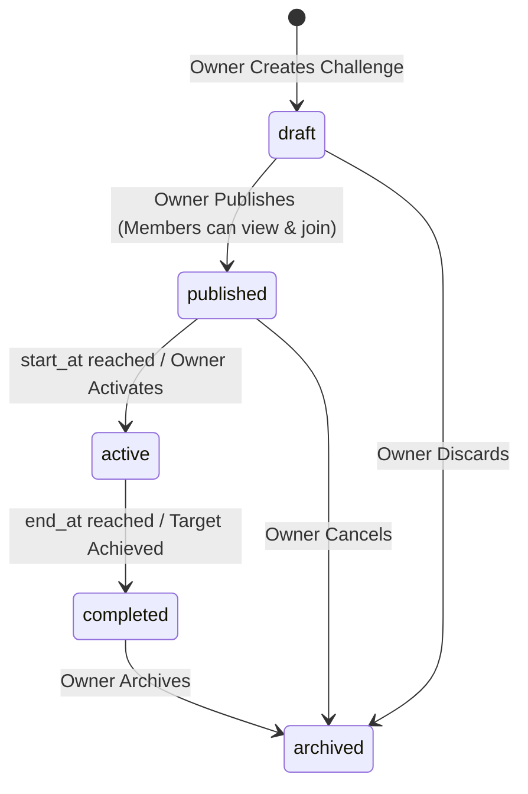

# Combined Phase — G4 Personal Chat + G5 Gym Challenges + G5 Gym Leaderboard
## Forensic R&D Audit & Technical Architecture Specification

**Date:** September 19, 2026  
**Phase:** Combined Social & Gamification Phase (G4 Personal Chat + G5-A Gym Challenges + G5-B Gym Leaderboard)  
**Parent Phases:**  
* Personal V1 (Live)  
* Phase C1–C7: Member Gym Integration & Core Attendance Sessions (Live)  
* Phase G1: Gym Retention Foundation & Attendance Streaks (Live)  
* Phase G2: Gym Community & Moderation (Live)  
* Phase G3: Dynamic Gym Buddy Matching & Safety Controls (Live)  
* Stationary Desktop Sidebar Layout Architecture (Live)  

---

## 1. Executive Summary

This forensic audit analyzes the system requirements, schema dependencies, security models, concurrency constraints, and UX architectures necessary to deliver three major social and gamification capabilities to the FitBoost ecosystem as a unified release:

1. **Phase G4 — Personal 1:1 Buddy Chat:** Private, end-to-end authenticated bilateral messaging strictly between active, mutually accepted gym buddies anchored to `gym_buddy_connections.id`.
2. **Phase G5-A — Gym Challenges:** Owner-configured, facility-scoped motivational competitions scored 100% deterministically from authoritative attendance (`gym_attendance_sessions`) and workout records (`workout_sessions`, `workout_sets`).
3. **Phase G5-B — Gym Leaderboard:** Challenge-scoped, privacy-preserving, server-paginated member rankings with deterministic multi-level tie-breaking and zero client score injection.

All work respects existing non-regression invariants: Personal V1, Personal Streak, Gym Attendance Streaks, Rewards, Community Posts, Community Moderation, Buddy Compatibility Math, and the desktop stationary sidebar architecture.

---

## 2. Existing Architecture & Reusable Primitives

A deep forensic inspection of the codebase yields the following reusable domain, database, and UI primitives:

### A. G3 Gym Buddy Architecture (`gym_buddy_connections`, `gym_buddy_blocks`, `gym_buddy_reports`)
- **Canonical Connection Invariant:** `public.gym_buddy_connections` enforces `user_a_id < user_b_id` through `chk_canonical_user_order`.
- **Partial Unique Active Index:** `uq_buddy_connection_active` on `(gym_id, user_a_id, user_b_id)` WHERE `status IN ('pending', 'accepted')`.
- **Handshake Lifecycle:** States are strictly `'pending'`, `'accepted'`, `'declined'`, `'cancelled'`, `'ended'`.
- **Global Safety & Mutual Invisibility:** `public.gym_buddy_blocks` records `(blocker_id, blocked_id)`. Any active block immediately severs matching and connection visibility.
- **Facility Conduct Moderation:** `public.gym_buddy_reports` allows reporting bad actors directly to facility owners without leaking personal contact info.
- **Primitive for G4:** `gym_buddy_connections.id` serves as the authoritative, unique, immutable conversation identity. No secondary conversation table with detached user-pair identities is permitted.

### B. G1 Attendance & Verification Engine (`gym_attendance_sessions`)
- **Lifecycle:** Created via verified check-in (`qr_scan`, `gps_geofence`, `reception_manual`) with `status = 'active'`, terminated upon check-out with `status = 'completed'`.
- **Server Calculation:** `fn_compute_attendance_duration()` trigger auto-derives duration on checkout.
- **Concurrency Guard:** Unique partial index `uq_user_single_active_attendance` guarantees a user has at most 1 active session facility-wide.
- **Primitive for G5-A:** Authoritative source of attendance challenge progress. Distinct completed visit dates (`check_in_at::DATE`) eliminate double-scan gaming.

### C. Workout Engine & Volume Tracking (`workout_sessions`, `workout_sets`)
- **Completion Authority:** `complete_workout_session` SECURITY DEFINER RPC validates session ownership, verifies working sets (`weight_kg > 0 AND reps > 0`), updates personal records, writes to append-only `pr_history`, and derives authoritative quality score.
- **Volume Primitive:** `SUM(ws.weight_kg * ws.reps)` from `public.workout_sets ws JOIN public.workout_session_exercises wse ON wse.id = ws.session_exercise_id WHERE wse.session_id = ... AND ws.completed = TRUE`.
- **Primitive for G5-A:** Authoritative workout count and workout volume metrics are strictly derived from finalized `workout_sessions` (`status = 'completed'`), preventing client-side score falsification.

### D. Multi-Tenancy & Role Isolation (`gym_memberships`, `gyms`)
- **Membership Status:** `'active'`, `'pending'`, `'frozen'`, `'cancelled'`, `'expired'`.
- **Role Model:** `profiles.account_role` in `('member', 'gym_owner', 'platform_admin')`.
- **Facility Ownership:** `gyms.owner_id = auth.uid()`.
- **Primitives for G4 & G5:**
  - Active membership at `gym_id` is a hard prerequisite for joining gym challenges and participating in buddy chats.
  - Owners own challenges in their gym, but are barred from participating as members in challenges or viewing private buddy chats.

---

## 3. Forensic Gap Analysis

| Feature Area | Existing State in Codebase | Identified Gap | Required Architectural Solution |
| :--- | :--- | :--- | :--- |
| **G4 1:1 Chat** | Zero messaging tables or routes exist. | No storage for chat messages, read status, or message lifecycle. | Create `public.gym_chat_messages` permanently tied to `gym_buddy_connections.id`. Implement participant-only RLS and server-authoritative `send_gym_chat_message` RPC. |
| **G4 Realtime** | Supabase Realtime channel subscription is absent across client. | Messages require live delivery without constant aggressive polling. | Enable Supabase Realtime publication on `gym_chat_messages`. Client subscribes with filter `connection_id=eq.<id>`, verified by participant RLS. |
| **G4 Lifecycle** | Unmatch/Block sets connection to `ended` or inserts into `gym_buddy_blocks`. | Chat sending must be blocked when status is not `accepted` or when block exists. | Server validation in `send_gym_chat_message` checks `status = 'accepted'` and verifies neither party has an active block in `gym_buddy_blocks`. |
| **G5-A Challenges** | `OwnerChallengesView.tsx` is an empty 55-line placeholder. Zero member challenge views. | No challenge definition, participant registration, or progress derivation. | Create `public.gym_challenges`, `public.gym_challenge_participants`, and `public.gym_challenge_progress_events`. Full owner management console and member challenge hub. |
| **G5-A Progress** | No automated challenge crediting mechanism. | Need anti-cheat derivation from attendance and workout completion events. | Event ledger architecture (`gym_challenge_progress_events`) with unique constraint on `(challenge_id, user_id, source_id)` to guarantee strictly idempotent, deduplicated score crediting. |
| **G5-B Leaderboard**| Zero leaderboard tables or queries exist. | Need challenge-scoped ranking with deterministic tie-breaking and bounded pagination. | Server-side RPC `get_gym_challenge_leaderboard(p_challenge_id, p_limit, p_offset)` with window function ranking (`DENSE_RANK() OVER (ORDER BY current_score DESC, completed_at ASC NULLS LAST, last_progress_at ASC NULLS LAST, user_id ASC)`). |
| **Leaderboard Privacy**| Member profiles expose various fields. | Leaderboard must never expose email, phone, biometrics, or private logs. | Leaderboard RPC explicitly projects ONLY `user_id`, `display_name`, `avatar_url`, `rank`, `score`, `progress_pct`, `completed_at`. |

---

## 4. Feature 1: G4 Personal 1:1 Chat Architecture

### A. Conversation Authority & Binding
- A chat conversation has **zero** existence separate from an active `gym_buddy_connections` row.
- Conversation Identity = `gym_buddy_connections.id` (UUID).
- A connection allows message creation **IF AND ONLY IF**:
  1. `gym_buddy_connections.status = 'accepted'`
  2. No row exists in `public.gym_buddy_blocks` where `(blocker_id = user_a AND blocked_id = user_b)` OR `(blocker_id = user_b AND blocked_id = user_a)`.
  3. `auth.uid()` equals either `user_a_id` or `user_b_id`.
- If a connection transitions to `'ended'` (unmatch) or a user blocks the other:
  - Existing message history is preserved (read-only for non-blocked participants for accountability and dispute audit).
  - Attempting to insert a new message is strictly rejected with error `Connection is not active or user is blocked`.

### B. Proposed Chat Schema: `public.gym_chat_messages`
```sql
CREATE TABLE IF NOT EXISTS public.gym_chat_messages (
    id UUID PRIMARY KEY DEFAULT gen_random_uuid(),
    connection_id UUID NOT NULL REFERENCES public.gym_buddy_connections(id) ON DELETE CASCADE,
    sender_id UUID NOT NULL REFERENCES public.profiles(id) ON DELETE CASCADE,
    content TEXT NOT NULL CHECK (char_length(trim(content)) >= 1 AND char_length(content) <= 2000),
    read_at TIMESTAMPTZ,
    edited_at TIMESTAMPTZ,
    deleted_at TIMESTAMPTZ,
    created_at TIMESTAMPTZ DEFAULT NOW() NOT NULL,
    updated_at TIMESTAMPTZ DEFAULT NOW() NOT NULL
);

-- Fast lookup of messages in reverse chronological order for pagination
CREATE INDEX IF NOT EXISTS idx_gym_chat_messages_lookup
ON public.gym_chat_messages (connection_id, created_at DESC)
WHERE deleted_at IS NULL;

CREATE INDEX IF NOT EXISTS idx_gym_chat_messages_unread
ON public.gym_chat_messages (connection_id, read_at)
WHERE read_at IS NULL AND deleted_at IS NULL;
```

### C. Chat Security & RLS Matrix
1. **Row Level Security (RLS) on `gym_chat_messages`**:
   - `SELECT`: Allowed ONLY if `auth.uid()` is `user_a_id` OR `user_b_id` of the referenced `gym_buddy_connections` row.
   - `INSERT`: Prohibited directly via client (`WITH CHECK (FALSE)`) OR restricted via authoritative RPC `send_gym_chat_message` to enforce connection status, rate limiting, and block checks transactionally.
   - `UPDATE`: Allowed ONLY for `auth.uid() = sender_id` (for editing text, setting `edited_at = NOW()`) or for peer setting `read_at = NOW()`. Direct client deletion prohibited.
   - `DELETE`: Prohibited directly (soft-delete via setting `deleted_at = NOW()` by sender only).
2. **Owner Isolation:** Facility owners have **zero** read or write permissions on `gym_chat_messages`. Private member communication is completely segregated from facility administration.
3. **Cross-Gym Segregation:** `connection_id` implicitly ties messages to `gym_buddy_connections.gym_id`. A participant can only see messages within their own valid connection.

### D. Realtime Subscription Protocol
- Supabase Realtime is enabled on `public.gym_chat_messages`.
- Client subscribes to channel `gym-chat:${connectionId}` with Postgres change filter `event: 'INSERT', schema: 'public', table: 'gym_chat_messages', filter: 'connection_id=eq.' + connectionId`.
- Supabase Realtime respects PostgreSQL RLS; unauthenticated or non-participant clients receive 0 events.
- Fallback: Transparent HTTP polling fallback if WebSocket connection drops or is blocked by network proxies.

---

## 5. Feature 2: G5-A Gym Challenges Architecture

### A. Challenge Entity Model
A challenge represents an intra-gym athletic competition initiated and managed by the verified facility owner.

```sql
CREATE TABLE IF NOT EXISTS public.gym_challenges (
    id UUID PRIMARY KEY DEFAULT gen_random_uuid(),
    gym_id UUID NOT NULL REFERENCES public.gyms(id) ON DELETE CASCADE,
    title VARCHAR(120) NOT NULL CHECK (char_length(trim(title)) >= 3),
    description TEXT CHECK (description IS NULL OR char_length(trim(description)) <= 2000),
    challenge_type TEXT NOT NULL CHECK (challenge_type IN ('attendance_count', 'workout_count', 'workout_volume', 'attendance_streak')),
    status TEXT DEFAULT 'draft' NOT NULL CHECK (status IN ('draft', 'published', 'active', 'completed', 'archived')),
    target_value NUMERIC(12,2) NOT NULL CHECK (target_value > 0),
    scoring_unit TEXT NOT NULL CHECK (scoring_unit IN ('days', 'workouts', 'kg', 'streak_days')),
    start_at TIMESTAMPTZ NOT NULL,
    end_at TIMESTAMPTZ NOT NULL,
    reward_badge_name VARCHAR(60),
    reward_coins INT DEFAULT 0 CHECK (reward_coins >= 0),
    created_by UUID NOT NULL REFERENCES public.profiles(id) ON DELETE RESTRICT,
    created_at TIMESTAMPTZ DEFAULT NOW() NOT NULL,
    updated_at TIMESTAMPTZ DEFAULT NOW() NOT NULL,
    CONSTRAINT chk_challenge_date_window CHECK (end_at > start_at)
);

CREATE INDEX IF NOT EXISTS idx_gym_challenges_gym_status
ON public.gym_challenges (gym_id, status, start_at DESC);
```

### B. Challenge Lifecycle State Machine

- **Invariant:** Progress events are credited **only** while `status = 'active'` AND the authoritative event timestamp falls within `[start_at, end_at]`.

### C. Challenge Participation: `public.gym_challenge_participants`
```sql
CREATE TABLE IF NOT EXISTS public.gym_challenge_participants (
    id UUID PRIMARY KEY DEFAULT gen_random_uuid(),
    challenge_id UUID NOT NULL REFERENCES public.gym_challenges(id) ON DELETE CASCADE,
    gym_id UUID NOT NULL REFERENCES public.gyms(id) ON DELETE CASCADE,
    user_id UUID NOT NULL REFERENCES public.profiles(id) ON DELETE CASCADE,
    status TEXT DEFAULT 'active' NOT NULL CHECK (status IN ('active', 'completed', 'withdrawn')),
    current_score NUMERIC(12,2) DEFAULT 0 NOT NULL CHECK (current_score >= 0),
    target_achieved_at TIMESTAMPTZ,
    last_progress_at TIMESTAMPTZ,
    joined_at TIMESTAMPTZ DEFAULT NOW() NOT NULL,
    updated_at TIMESTAMPTZ DEFAULT NOW() NOT NULL,
    CONSTRAINT uq_challenge_participant UNIQUE (challenge_id, user_id)
);

CREATE INDEX IF NOT EXISTS idx_challenge_participants_ranking
ON public.gym_challenge_participants (challenge_id, current_score DESC, target_achieved_at ASC NULLS LAST, last_progress_at ASC NULLS LAST);
```

### D. Anti-Cheat Event Ledger: `public.gym_challenge_progress_events`
To eliminate duplicate counting, replay attacks, and client manipulation:
```sql
CREATE TABLE IF NOT EXISTS public.gym_challenge_progress_events (
    id UUID PRIMARY KEY DEFAULT gen_random_uuid(),
    challenge_id UUID NOT NULL REFERENCES public.gym_challenges(id) ON DELETE CASCADE,
    user_id UUID NOT NULL REFERENCES public.profiles(id) ON DELETE CASCADE,
    source_type TEXT NOT NULL CHECK (source_type IN ('attendance_session', 'workout_session')),
    source_id UUID NOT NULL,
    metric_value NUMERIC(12,2) NOT NULL CHECK (metric_value > 0),
    event_date DATE NOT NULL,
    created_at TIMESTAMPTZ DEFAULT NOW() NOT NULL,
    CONSTRAINT uq_challenge_source_event UNIQUE (challenge_id, user_id, source_type, source_id),
    CONSTRAINT uq_challenge_daily_attendance UNIQUE (challenge_id, user_id, source_type, event_date)
);
```
- For `attendance_count`: Deduplicated per user per challenge per calendar day (`uq_challenge_daily_attendance`).
- For `workout_count` / `workout_volume`: Exactly one progress record per `workout_session_id`.
- The ledger guarantees **idempotency**: Re-running progress derivation yields identical scores.

---

## 6. Feature 3: G5-B Gym Leaderboard Architecture

### A. Deterministic Scoring & Multi-Level Tie-Breaking
The leaderboard derives ranking strictly from `public.gym_challenge_participants`:
1. **Primary Score:** `current_score DESC` (Highest attendance days, workout count, volume, or streak).
2. **Secondary Tie-Break:** `target_achieved_at ASC NULLS LAST` (Who reached the goal first).
3. **Tertiary Tie-Break:** `last_progress_at ASC NULLS LAST` (Who achieved their latest milestone earliest).
4. **Final Invariant Tie-Break:** `user_id ASC` (RFC 4122 UUID lexicographical order for 100% deterministic ranking).

### B. Leaderboard Data Privacy Protocol
Leaderboard rows must never leak private biometrics or contact details:
- **Exposed Fields:** `user_id`, `display_name`, `avatar_url`, `rank`, `current_score`, `target_value`, `scoring_unit`, `progress_percentage`, `is_completed`, `target_achieved_at`.
- **Protected / Redacted Fields:** `email`, `phone`, `medical limitations`, `weight`, `height`, `age`, `body fat`, `dietary preferences`, `private workout notes`.
- **Frozen Members:** If a member freezes their membership, their accumulated score remains frozen; they are visually marked as inactive or hidden based on challenge settings.

### C. Server-Side Window Query (`get_gym_challenge_leaderboard`)
```sql
CREATE OR REPLACE FUNCTION public.get_gym_challenge_leaderboard(
    p_challenge_id UUID,
    p_limit INT DEFAULT 20,
    p_offset INT DEFAULT 0
)
RETURNS TABLE (
    rank BIGINT,
    user_id UUID,
    display_name TEXT,
    avatar_url TEXT,
    current_score NUMERIC,
    target_value NUMERIC,
    scoring_unit TEXT,
    progress_percentage NUMERIC,
    is_completed BOOLEAN,
    target_achieved_at TIMESTAMPTZ,
    last_progress_at TIMESTAMPTZ
)
LANGUAGE plpgsql
SECURITY DEFINER
SET search_path = public, auth
AS $$
...
$$;
```

---

## 7. Concurrency, Integrity & Anti-Abuse Controls

1. **Deadlock Prevention in Chat:** Messages are append-only. No cross-row locks required.
2. **Race-Condition Free Challenge Joining:** Unique constraint `(challenge_id, user_id)` guarantees concurrent join clicks fail gracefully with idempotency.
3. **Atomic Progress Crediting:** `record_challenge_progress` RPC acquires row lock on `gym_challenge_participants WHERE challenge_id = ... AND user_id = ... FOR UPDATE` before updating score.
4. **Chat Rate Limiting:** Enforce a maximum of 30 messages per rolling minute per user across all connections. Exceeding threshold raises HTTP 429 / SQL exception `42900`.
5. **Message Content Sanitization:** Max 2000 characters, whitespace trimmed, raw HTML entities escaped on render.
6. **Cross-Tenant Challenge Isolation:** Challenge queries enforce `gym_id = <context_gym_id>`. An owner or member from Gym A cannot view or participate in Gym B's challenges.

---

## 8. Frontend Navigation & Desktop Stationary Sidebar Integration

### A. Member Gym Hub Navigation
Under `/app/gym`:
- `Overview` (`/app/gym`)
- `Community` (`/app/gym/community`)
- `Buddies` (`/app/gym/buddies`)
- `Chat` (`/app/gym/buddies/:connectionId/chat`)
- `Challenges` (`/app/gym/challenges`)
- `History` (`/app/gym/history`)

### B. Owner Navigation
Under `/owner`:
- `Dashboard` (`/owner/dashboard`)
- `Members` (`/owner/members`)
- `Community` (`/owner/community`)
- `Challenges` (`/owner/challenges` — rebuilt with active, draft, completed tabs, participant roster, leaderboard viewer)
- `Announcements` (`/owner/announcements`)
- `Rewards` (`/owner/rewards`)

### C. Desktop Layout Invariant
- Desktop sidebar remains `position: fixed; width: 275px; height: 100vh; overflow: hidden`.
- Main page wrapper owns vertical scrolling.
- Mobile bottom navigation and mobile top bar remain fully responsive without regressions.

---

## 9. Forensic Audit Summary & Next Action

The audit confirms:
1. Reusable primitives from G1, G2, and G3 provide the foundation for G4 and G5.
2. Direct connection-based identity (`gym_buddy_connections.id`) eliminates redundant conversation join tables.
3. Ledger-backed progress calculation prevents cheating, duplicates, and client score tampering.
4. Privacy and RLS boundaries isolate private chat from gym owners and preserve participant privacy on challenge leaderboards.

Proceed to compile the detailed implementation plan in `docs/phases/g4-g5/combined-g4-g5-implementation-plan.md`.
