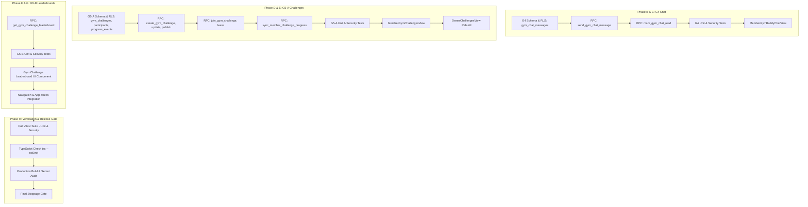

# Combined Phase — G4 Personal Chat + G5 Gym Challenges + G5 Gym Leaderboard
## Comprehensive Implementation Plan & Technical Execution Blueprint

**Date:** September 19, 2026  
**Phase:** Combined Social & Gamification Release (G4 + G5-A + G5-B)  
**Parent Phases:** G1 (Retention), G2 (Community & Moderation), G3 (Dynamic Buddy Matching)  

---

## 1. Architecture Overview & Implementation Stages

This implementation plan details the step-by-step engineering rollout for G4 Personal 1:1 Chat, G5-A Gym Challenges, and G5-B Gym Leaderboards. All components are built with strict server-authoritative validation, multi-tenant database isolation, zero client score injection, and robust test suites.



---

## 2. Database Schema & Migration Specifications

Migration file to create:
`supabase/migrations/20260923000001_gym_chat_and_challenges.sql`

### A. G4 Personal Chat: `public.gym_chat_messages`
- **Table**: `public.gym_chat_messages`
  - `id UUID PRIMARY KEY DEFAULT gen_random_uuid()`
  - `connection_id UUID NOT NULL REFERENCES public.gym_buddy_connections(id) ON DELETE CASCADE`
  - `sender_id UUID NOT NULL REFERENCES public.profiles(id) ON DELETE CASCADE`
  - `content TEXT NOT NULL CHECK (char_length(trim(content)) >= 1 AND char_length(content) <= 2000)`
  - `read_at TIMESTAMPTZ`
  - `edited_at TIMESTAMPTZ`
  - `deleted_at TIMESTAMPTZ`
  - `created_at TIMESTAMPTZ DEFAULT NOW() NOT NULL`
  - `updated_at TIMESTAMPTZ DEFAULT NOW() NOT NULL`
- **Indexes**:
  - `idx_chat_messages_conn_created` on `(connection_id, created_at DESC)` WHERE `deleted_at IS NULL`
  - `idx_chat_messages_unread` on `(connection_id, read_at)` WHERE `read_at IS NULL AND deleted_at IS NULL`
  - `idx_chat_messages_sender_rate` on `(sender_id, created_at DESC)`

### B. G5-A Challenges: `public.gym_challenges`
- **Table**: `public.gym_challenges`
  - `id UUID PRIMARY KEY DEFAULT gen_random_uuid()`
  - `gym_id UUID NOT NULL REFERENCES public.gyms(id) ON DELETE CASCADE`
  - `title VARCHAR(120) NOT NULL CHECK (char_length(trim(title)) >= 3)`
  - `description TEXT CHECK (description IS NULL OR char_length(trim(description)) <= 2000)`
  - `challenge_type TEXT NOT NULL CHECK (challenge_type IN ('attendance_count', 'workout_count', 'workout_volume', 'attendance_streak'))`
  - `status TEXT DEFAULT 'draft' NOT NULL CHECK (status IN ('draft', 'published', 'active', 'completed', 'archived'))`
  - `target_value NUMERIC(12,2) NOT NULL CHECK (target_value > 0)`
  - `scoring_unit TEXT NOT NULL CHECK (scoring_unit IN ('days', 'workouts', 'kg', 'streak_days'))`
  - `start_at TIMESTAMPTZ NOT NULL`
  - `end_at TIMESTAMPTZ NOT NULL`
  - `reward_badge_name VARCHAR(60)`
  - `reward_coins INT DEFAULT 0 CHECK (reward_coins >= 0)`
  - `created_by UUID NOT NULL REFERENCES public.profiles(id) ON DELETE RESTRICT`
  - `created_at TIMESTAMPTZ DEFAULT NOW() NOT NULL`
  - `updated_at TIMESTAMPTZ DEFAULT NOW() NOT NULL`
  - `CONSTRAINT chk_challenge_date_window CHECK (end_at > start_at)`
- **Indexes**:
  - `idx_gym_challenges_gym_status` on `(gym_id, status, start_at DESC)`

### C. G5-A Participants: `public.gym_challenge_participants`
- **Table**: `public.gym_challenge_participants`
  - `id UUID PRIMARY KEY DEFAULT gen_random_uuid()`
  - `challenge_id UUID NOT NULL REFERENCES public.gym_challenges(id) ON DELETE CASCADE`
  - `gym_id UUID NOT NULL REFERENCES public.gyms(id) ON DELETE CASCADE`
  - `user_id UUID NOT NULL REFERENCES public.profiles(id) ON DELETE CASCADE`
  - `status TEXT DEFAULT 'active' NOT NULL CHECK (status IN ('active', 'completed', 'withdrawn'))`
  - `current_score NUMERIC(12,2) DEFAULT 0 NOT NULL CHECK (current_score >= 0)`
  - `target_achieved_at TIMESTAMPTZ`
  - `last_progress_at TIMESTAMPTZ`
  - `joined_at TIMESTAMPTZ DEFAULT NOW() NOT NULL`
  - `updated_at TIMESTAMPTZ DEFAULT NOW() NOT NULL`
  - `CONSTRAINT uq_challenge_participant UNIQUE (challenge_id, user_id)`
- **Indexes**:
  - `idx_challenge_participants_ranking` on `(challenge_id, current_score DESC, target_achieved_at ASC NULLS LAST, last_progress_at ASC NULLS LAST)`
  - `idx_challenge_participants_user` on `(user_id, status)`

### D. G5-A Progress Events Ledger: `public.gym_challenge_progress_events`
- **Table**: `public.gym_challenge_progress_events`
  - `id UUID PRIMARY KEY DEFAULT gen_random_uuid()`
  - `challenge_id UUID NOT NULL REFERENCES public.gym_challenges(id) ON DELETE CASCADE`
  - `user_id UUID NOT NULL REFERENCES public.profiles(id) ON DELETE CASCADE`
  - `source_type TEXT NOT NULL CHECK (source_type IN ('attendance_session', 'workout_session'))`
  - `source_id UUID NOT NULL`
  - `metric_value NUMERIC(12,2) NOT NULL CHECK (metric_value > 0)`
  - `event_date DATE NOT NULL`
  - `created_at TIMESTAMPTZ DEFAULT NOW() NOT NULL`
  - `CONSTRAINT uq_challenge_source_event UNIQUE (challenge_id, user_id, source_type, source_id)`
  - `CONSTRAINT uq_challenge_daily_attendance UNIQUE (challenge_id, user_id, source_type, event_date)`

---

## 3. Server-Authoritative RPC Inventory

All RPCs operate with `SECURITY DEFINER` and `SET search_path = public, auth`.

### G4 Chat RPCs
1. **`send_gym_chat_message(p_connection_id UUID, p_content TEXT) RETURNS JSONB`**:
   - Validates `auth.uid() IS NOT NULL`.
   - Validates connection exists and user is participant (`user_a_id = auth.uid() OR user_b_id = auth.uid()`).
   - Validates connection `status = 'accepted'`.
   - Validates no active block in `public.gym_buddy_blocks` between either participant.
   - Enforces rate limit: Maximum 30 messages in the preceding 60 seconds across all connections for `auth.uid()`.
   - Sanitizes and validates length (`1..2000` characters).
   - Inserts message into `public.gym_chat_messages`.
   - Returns inserted message object.

2. **`mark_gym_chat_read(p_connection_id UUID) RETURNS INT`**:
   - Validates `auth.uid()` is participant of `p_connection_id`.
   - Updates `read_at = NOW()` for all unread messages in `p_connection_id` where `sender_id != auth.uid()`.
   - Returns count of updated messages.

3. **`edit_gym_chat_message(p_message_id UUID, p_new_content TEXT) RETURNS JSONB`**:
   - Validates `auth.uid() = sender_id`.
   - Validates message not soft-deleted (`deleted_at IS NULL`).
   - Updates `content = p_new_content, edited_at = NOW()`.

4. **`delete_gym_chat_message(p_message_id UUID) RETURNS BOOLEAN`**:
   - Validates `auth.uid() = sender_id`.
   - Sets `deleted_at = NOW()`.

### G5-A Challenges RPCs
1. **`create_gym_challenge(...) RETURNS JSONB`**:
   - Validates `auth.uid()` is owner of `p_gym_id`.
   - Validates dates (`end_at > start_at`) and target value (`> 0`).
   - Inserts with status `'draft'`.

2. **`publish_gym_challenge(p_challenge_id UUID) RETURNS JSONB`**:
   - Validates facility ownership.
   - Transitions challenge from `'draft'` to `'published'` (or `'active'` if `start_at <= NOW()`).

3. **`join_gym_challenge(p_challenge_id UUID) RETURNS JSONB`**:
   - Validates `auth.uid()` holds `status = 'active'` membership at the challenge's gym.
   - Rejects gym owners / admins participating as members.
   - Validates challenge `status IN ('published', 'active')` and `end_at > NOW()`.
   - Inserts into `public.gym_challenge_participants` with `status = 'active', current_score = 0`.
   - Immediately triggers backfill derivation for any completed attendance or workout events within `[start_at, NOW()]`.

4. **`sync_member_challenge_progress(p_challenge_id UUID, p_user_id UUID DEFAULT NULL) RETURNS JSONB`**:
   - Authoritative derivation engine:
     - For `attendance_count`: Finds completed `gym_attendance_sessions` where `gym_id = challenge.gym_id` and `check_in_at BETWEEN challenge.start_at AND challenge.end_at`.
     - For `workout_count`: Finds completed `workout_sessions` for user within challenge dates.
     - For `workout_volume`: Computes `SUM(ws.weight_kg * ws.reps)` from completed workout sessions.
     - For `attendance_streak`: Evaluates current attendance streak within gym context.
   - Records new events into `public.gym_challenge_progress_events` (ignoring duplicates via ON CONFLICT DO NOTHING).
   - Recalculates `current_score` on `public.gym_challenge_participants`.
   - Sets `target_achieved_at = NOW()` and `status = 'completed'` when `current_score >= target_value`.

### G5-B Leaderboard RPC
1. **`get_gym_challenge_leaderboard(p_challenge_id UUID, p_limit INT DEFAULT 20, p_offset INT DEFAULT 0) RETURNS TABLE (...)`**:
   - Validates challenge exists.
   - Checks caller eligibility: Active member at that gym or owner of that gym.
   - Executes deterministic window ranking:
     ```sql
     DENSE_RANK() OVER (
         ORDER BY cp.current_score DESC,
                  cp.target_achieved_at ASC NULLS LAST,
                  cp.last_progress_at ASC NULLS LAST,
                  cp.user_id ASC
     ) AS rank
     ```
   - Projects ONLY safe profile fields (`display_name`, `avatar_url`) joining with `public.profiles`.
   - Computes `progress_percentage = LEAST(100.0, ROUND((cp.current_score / c.target_value) * 100.0, 1))`.
   - Returns bounded paginated rows.

---

## 4. Row Level Security (RLS) Policy Matrix

| Table | Operation | Target Role | Policy Condition (`USING` / `WITH CHECK`) | Rationale |
| :--- | :--- | :--- | :--- | :--- |
| `gym_chat_messages` | SELECT | `authenticated` | `EXISTS (SELECT 1 FROM gym_buddy_connections c WHERE c.id = gym_chat_messages.connection_id AND (c.user_a_id = auth.uid() OR c.user_b_id = auth.uid()))` | Participant-only chat visibility |
| `gym_chat_messages` | INSERT | `authenticated` | `WITH CHECK (FALSE)` | All chat creation must route through `send_gym_chat_message` RPC |
| `gym_chat_messages` | UPDATE | `authenticated` | `USING (sender_id = auth.uid() OR (EXISTS (SELECT 1 FROM gym_buddy_connections c WHERE c.id = connection_id AND (c.user_a_id = auth.uid() OR c.user_b_id = auth.uid()))))` | Sender edits message; recipient updates `read_at` |
| `gym_chat_messages` | DELETE | `authenticated` | `USING (FALSE)` | Hard deletion prohibited; only soft delete via UPDATE `deleted_at` |
| `gym_challenges` | SELECT | `authenticated` | `EXISTS (SELECT 1 FROM gym_memberships m WHERE m.gym_id = gym_challenges.gym_id AND m.user_id = auth.uid() AND m.status = 'active') OR EXISTS (SELECT 1 FROM gyms g WHERE g.id = gym_challenges.gym_id AND g.owner_id = auth.uid())` | Active members and facility owner view challenges |
| `gym_challenges` | ALL | `authenticated` | `EXISTS (SELECT 1 FROM gyms g WHERE g.id = gym_challenges.gym_id AND g.owner_id = auth.uid())` | Only verified facility owner creates/updates challenges |
| `gym_challenge_participants`| SELECT | `authenticated` | `Same gym membership or owner check as challenges` | Participants visible within intra-gym leaderboard context |
| `gym_challenge_participants`| INSERT | `authenticated` | `WITH CHECK (auth.uid() = user_id AND EXISTS (SELECT 1 FROM gym_memberships m WHERE m.gym_id = gym_challenge_participants.gym_id AND m.user_id = auth.uid() AND m.status = 'active'))` | Member joins own participation |
| `gym_challenge_participants`| UPDATE | `authenticated` | `USING (FALSE)` | Direct client score/status tampering completely prohibited |
| `gym_challenge_progress_events` | ALL | `authenticated` | `USING (FALSE) WITH CHECK (FALSE)` | Direct client mutation blocked; server RPC authoritative only |

---

## 5. Domain, Service & Repository Layer Design

### A. TypeScript Type Definitions (`src/types/gym.types.ts`)
- `GymChatMessage`: `id`, `connectionId`, `senderId`, `content`, `readAt`, `editedAt`, `deletedAt`, `createdAt`, `updatedAt`.
- `GymChallenge`: `id`, `gymId`, `title`, `description`, `challengeType`, `status`, `targetValue`, `scoringUnit`, `startAt`, `endAt`, `rewardBadgeName`, `rewardCoins`, `createdBy`, `createdAt`, `updatedAt`.
- `GymChallengeParticipant`: `id`, `challengeId`, `gymId`, `userId`, `status`, `currentScore`, `targetAchievedAt`, `lastProgressAt`, `joinedAt`, `updatedAt`.
- `GymChallengeLeaderboardEntry`: `rank`, `userId`, `displayName`, `avatarUrl`, `currentScore`, `targetValue`, `scoringUnit`, `progressPercentage`, `isCompleted`, `targetAchievedAt`, `lastProgressAt`.

### B. Repositories (`src/repositories/gym.repository.ts`)
Add methods:
- Chat:
  - `getChatMessages(connectionId: string, limit?: number, beforeTimestamp?: string): Promise<GymChatMessage[]>`
  - `sendChatMessage(connectionId: string, content: string): Promise<GymChatMessage>`
  - `markChatRead(connectionId: string): Promise<number>`
  - `editChatMessage(messageId: string, newContent: string): Promise<GymChatMessage>`
  - `deleteChatMessage(messageId: string): Promise<boolean>`
- Challenges:
  - `getChallenges(gymId: string, statusFilter?: string): Promise<GymChallenge[]>`
  - `getChallengeById(challengeId: string): Promise<GymChallenge | null>`
  - `createChallenge(challenge: Partial<GymChallenge>): Promise<GymChallenge>`
  - `updateChallenge(challengeId: string, updates: Partial<GymChallenge>): Promise<GymChallenge>`
  - `publishChallenge(challengeId: string): Promise<GymChallenge>`
  - `joinChallenge(challengeId: string, gymId: string): Promise<GymChallengeParticipant>`
  - `getChallengeParticipants(challengeId: string): Promise<GymChallengeParticipant[]>`
  - `getMyChallengeParticipation(challengeId: string, userId: string): Promise<GymChallengeParticipant | null>`
  - `syncChallengeProgress(challengeId: string, userId?: string): Promise<void>`
  - `getChallengeLeaderboard(challengeId: string, limit?: number, offset?: number): Promise<GymChallengeLeaderboardEntry[]>`

### C. Services
- `src/services/gym-chat.service.ts`:
  - Handles message sending, optimistic local update, rate limit prevention, Realtime channel subscription management (`gym-chat:${connectionId}`), unread badge synchronization.
- `src/services/gym-challenge.service.ts`:
  - Handles challenge lifecycle transitions, member join, automatic progress sync on attendance and workout events, leaderboard retrieval.

---

## 6. Frontend UI / UX Components & Routes

### A. Routes to Register in `src/routes/AppRoutes.tsx`
- Member Routes (under `/app`):
  - `/app/gym/buddies/:connectionId/chat` -> `MemberGymBuddyChatView`
  - `/app/gym/challenges` -> `MemberGymChallengesView`
  - `/app/gym/challenges/:challengeId` -> `MemberGymChallengeDetailView`
- Owner Routes (under `/owner`):
  - `/owner/challenges` -> Rebuilt `OwnerChallengesView` with Create Modal, Draft Management, Active Challenges, Participant Roster, and Leaderboard Inspection.

### B. Member Navigation Tabs (`src/features/gym/MemberGymDiscoveryView.tsx` & subviews)
Add clean secondary subnavigation bar in gym views:
`Overview` | `Community` | `Buddies` | `Challenges` | `History`

### C. G4 Member Chat View (`MemberGymBuddyChatView.tsx`)
- Top bar with Buddy name, avatar, connection status, back button to buddies list, Block/Report actions.
- Scrollable message bubble feed with auto-scroll to bottom.
- Distinction between my messages (right, primary accent) and buddy messages (left, card glass background).
- Read receipt indicator (check marks).
- Send input with character counter (max 2000), enter to send, sanitized plain text rendering.
- Banner displaying "Connection ended" or "User blocked" if connection is no longer accepted, disabling input.

### D. G5-A & G5-B Member Challenges View (`MemberGymChallengesView.tsx`)
- Tabs: `Active Challenges`, `My Joined Challenges`, `Past Competitions`.
- Challenge Cards showing Title, Type badge, Start/End countdown, Target Value, Progress bar (if joined), Joined member count.
- Join CTA button with instant score calculation.
- Integrated Leaderboard Modal/Tab showing top members, user's rank, avatars, scores, progress %.

### E. Owner Challenges Management View (`OwnerChallengesView.tsx`)
- Dashboard cards: Active Challenges, Total Participants, Upcoming Competitions.
- "Create Challenge" modal with validation: Title, Type (attendance, workouts, volume, streak), Target value, Dates, Badge name, Reward coins.
- Challenge action buttons: `Publish`, `Archive`, `View Leaderboard`, `Sync Progress`.

---

## 7. Dedicated Unit & Security Test Suites

We will construct 6 comprehensive test suites matching the user request:

1. `tests/unit/gym-chat.test.ts`:
   - Validates message format, max length, empty content rejection.
   - Tests message send, pagination, read receipts, optimistic updates.
   - Tests soft deletion and message editing ownership.
2. `tests/security/g4-chat-security.test.ts`:
   - Strict participant-only isolation (User C cannot view or send to User A/B connection).
   - Rejection when connection is `pending`, `declined`, `cancelled`, or `ended`.
   - Rejection when either user is in `gym_buddy_blocks`.
   - Rate limiting enforcement (max 30 msgs/min).
   - Sender spoofing denial (cannot forge `sender_id != auth.uid()`).
   - Facility owner access denial (owners cannot view private member chats).
3. `tests/unit/gym-challenges.test.ts`:
   - Tests challenge creation, date validation, and state machine transitions (`draft -> published -> active -> completed -> archived`).
   - Tests member join and duplicate join idempotency.
   - Tests authoritative progress derivation across all 4 challenge types (attendance count, workout count, volume, streak).
4. `tests/security/g5-challenges-security.test.ts`:
   - Rejects non-members and inactive members from joining.
   - Rejects facility owners joining challenges as members.
   - Rejects client-supplied scores or progress mutations (direct update denied).
   - Cross-gym challenge isolation (Gym A member cannot join Gym B challenge).
   - Anti-cheat deduplication (same attendance day or same workout session not counted twice).
5. `tests/unit/gym-leaderboard.test.ts`:
   - Deterministic multi-level tie-breaking (Score DESC -> Target Achieved ASC -> Last Progress ASC -> User ID ASC).
   - Accurate progress percentage and completion flag calculations.
   - Bounded pagination and offset windowing.
6. `tests/security/g5-leaderboard-security.test.ts`:
   - Strict privacy enforcement: Email, phone, biometrics, weight, and private notes are absent from leaderboard output.
   - Non-integrated user access denial.
   - Cross-gym leaderboard isolation.

---

## 8. Exact Implementation Sequence

Execution will follow the strict phases outlined in the prompt:

1. **PHASE A (Complete)**: Forensic audit and detailed implementation plan saved to `docs/phases/g4-g5/`.
2. **PHASE B**: Implement G4 Chat backend migration (`supabase/migrations/20260923000001_gym_chat_and_challenges.sql` chat portion), repository methods, chat service, `tests/unit/gym-chat.test.ts`, and `tests/security/g4-chat-security.test.ts`.
3. **PHASE C**: Implement G4 Chat UI (`MemberGymBuddyChatView.tsx`), routes, navigation entry points, and chat UI validation.
4. **PHASE D**: Implement G5 Challenges backend migration (challenges, participants, progress events tables & RPCs), repository methods, challenge service, `tests/unit/gym-challenges.test.ts`, and `tests/security/g5-challenges-security.test.ts`.
5. **PHASE E**: Implement G5 Challenges UI (`MemberGymChallengesView.tsx`) and rebuild `OwnerChallengesView.tsx`.
6. **PHASE F**: Implement G5 Leaderboard backend RPC (`get_gym_challenge_leaderboard`), leaderboard tests (`tests/unit/gym-leaderboard.test.ts`, `tests/security/g5-leaderboard-security.test.ts`).
7. **PHASE G**: Implement Leaderboard UI components, tie-breaking display, and cross-feature navigation integration.
8. **PHASE H**: Full regression test run across all 57+ test suites, TypeScript typecheck, production build, secret audit, and final report.
