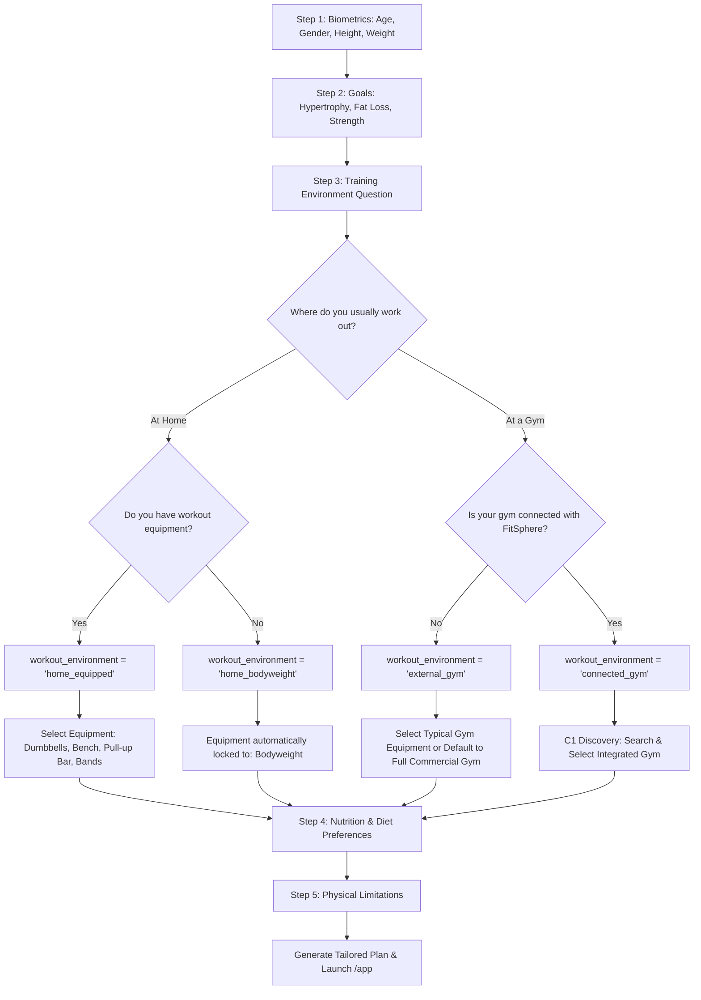

# FitSphere Architecture Plan: Account Roles & Workout Environments
**Document Status:** Complete & Verified (Phase C8 Implementation Ready for Review)  
**Target Milestone:** Phase C8 & Core Training Modernization  
**Author:** Antigravity Agent  
**Date:** September 16, 2026  

---

## 1. Executive Summary & Core Paradigm

FitSphere decouples **Account Identity (Role)** from **Training Context (Workout Environment)**.

```
ACCOUNT (profiles.account_role)
├── gym_owner (Facility Operator)
└── member (Normal Athlete)
      │
      └── WORKOUT ENVIRONMENT (fitness_profiles.workout_environment)
          ├── home_equipped     (Home with personal weights/gear)
          ├── home_bodyweight   (Home with zero equipment)
          ├── external_gym      (Unconnected / independent gym)
          └── connected_gym     (FitSphere partner gym with C1–C7 attendance)
```

### Core Architecture Rules
1. **Exactly TWO Account Roles:** `gym_owner` and `member`. There are no separate roles for different gym types or training styles.
2. **Exactly FOUR Workout Environments:** Available exclusively to `member` accounts.
3. **Zero Facility Friction for Non-Connected Users:** Athletes training at home or at non-partner gyms are never forced through QR check-ins, facility discovery, or owner approval gates.
4. **Deterministic, Safe Workout Generation:** The workout generator must never assign equipment an athlete does not have (e.g. barbell bench presses for bodyweight users).

---

## 2. Current Architecture Audit

### 2.1 Database & Type System
- **`public.profiles`**: Contains `account_role TEXT DEFAULT 'member'` (`'member' | 'gym_owner' | 'platform_admin'`) and `role_selected BOOLEAN DEFAULT false`.
- **`public.fitness_profiles`**: Contains biometrics, goals, `days_per_week`, `workout_duration_minutes`, `equipment TEXT[]`, `dietary_preference`, and `limitations TEXT[]`.
- **Deficiencies Identified:**
  - `workout_environment` is completely missing from `fitness_profiles`.
  - `equipment` is an unstructured array of strings with no validation against user environment.
  - Deprecated coordinates (`gym_latitude`, `gym_longitude`, `gym_radius_meters`) remain in TypeScript interfaces despite being removed from the live table schema.

### 2.2 Onboarding & Registration Flow
- **`RoleSelectionView.tsx`**: Prompts user for "Fitness Enthusiast" (`member`) vs "Gym Owner" (`gym_owner`).
- **`OnboardingWizard.tsx`**: Standard 5-step wizard (Biometrics → Goal → Schedule & Equipment → Nutrition → Limitations).
- **Deficiencies Identified:**
  - Step 3 presents a flat checklist: `['Barbell', 'Dumbbells', 'Cable', 'Bodyweight', 'Machines']`.
  - The wizard never asks where the user trains (Home vs Gym) or whether their facility is integrated with FitSphere.
  - A bodyweight user is still shown barbells and cable stations.

### 2.3 Gym Context Derivation (`gym-context.service.ts`)
- Currently derives `MemberGymMode` dynamically:
  - If user has an active row in `gym_memberships` → `'integrated'`.
  - Else if custom coordinates exist → `'non_integrated'`.
  - Else → `'home'`.
- **Deficiencies Identified:**
  - `home` does not know whether the user has dumbbells, kettlebells, or zero gear.
  - `non_integrated` is only triggered if GPS coordinates are saved; otherwise, gym athletes are misclassified as home users.
  - The mode is volatile and derived from membership state rather than an explicit user preference.

### 2.4 Workout Generator & Exercise Catalog
- **`workout-generator.ts` (`findExercise`)**:
  - Automatically injects `'bodyweight'` into the allowed equipment set (`equipSet.add('bodyweight')`).
  - Fallback vulnerability: If no exercise matches the primary muscle and equipment, it falls back to `availableExercises[0]` (which is `Barbell Bench Press`).
- **Catalog Inspection (`public.exercises`)**:
  - Total catalog: 22 exercises.
  - Categorized equipment: `Barbell` (8), `Dumbbells` (6), `Cable` (4), `Bodyweight` (4).
  - **Critical Gap:** The catalog has ZERO bodyweight exercises for Back (no Pull-Up/Inverted Row), Shoulders (no Pike Push-Up), Biceps (no Chin-Up), or Triceps (no Chair Dip/Diamond Push-Up).
  - Result: Any `home_bodyweight` user currently receives Barbell exercises as a fallback!

---

## 3. Final Role & Environment Model

### 3.1 Account Roles (`profiles.account_role`)
| Role | Identifier | Purpose | Available Routes |
| :--- | :--- | :--- | :--- |
| **Gym Owner** | `gym_owner` | Facility manager, QR display, floor sync, member roster | `/owner/*` (`/owner/dashboard`, `/owner/members`, `/owner/onboarding`) |
| **Normal User** | `member` | Athlete tracking workouts, nutrition, PRs, and optional gym attendance | `/app/*` (`/app/workouts`, `/app/nutrition`, `/app/progress`, etc.) |

*Note: `platform_admin` remains reserved for system administration.*

### 3.2 Workout Environments (`fitness_profiles.workout_environment`)
| Environment | Identifier | Description | Required Equipment | Facility Features |
| :--- | :--- | :--- | :--- | :--- |
| **Home + Equipment** | `home_equipped` | Trains at home with personal equipment | User-declared gear (e.g., Dumbbells, Bands, Pull-up Bar) | None |
| **Home (Bodyweight)** | `home_bodyweight` | Trains at home with zero equipment | Strictly `Bodyweight` / Space | None |
| **External Gym** | `external_gym` | Trains at a commercial or independent gym not on FitSphere | Full gym equipment (Dumbbells, Barbells, Cables, Machines) | None (no QR/attendance) |
| **Connected Gym** | `connected_gym` | Member of a verified FitSphere partner facility | Facility inventory + personal gear | Full C1–C7 (QR Check-in, Checkout, Attendance Log, Floor Sync) |

---

## 4. Registration & Onboarding Decision Trees

### 4.1 Registration Decision Tree
```mermaid
graph TD
    Start[User Sign Up / OAuth Callback] --> RoleCheck{Role Selected?}
    RoleCheck -->|No| SelectRole[Role Selection Screen]
    RoleCheck -->|Yes: gym_owner| OwnerRoute[/owner/dashboard]
    RoleCheck -->|Yes: member| MemberOnboardingCheck{Fitness Profile Exists?}
    
    SelectRole -->|Gym Owner| SetOwner[Set role = 'gym_owner'] --> OwnerOnboarding[/owner/onboarding]
    SelectRole -->|Athlete / Member| SetMember[Set role = 'member'] --> MemberOnboarding[/onboarding]
    
    MemberOnboardingCheck -->|No| MemberOnboarding
    MemberOnboardingCheck -->|Yes| MemberAppRoute[/app]
```

### 4.2 Member Onboarding Progressive Branching


---

## 5. Proposed Database Model

### 5.1 Schema Alterations
```sql
-- 1. Create native ENUM for workout environment
DO $$ BEGIN
    CREATE TYPE public.workout_environment_type AS ENUM (
        'home_equipped',
        'home_bodyweight',
        'external_gym',
        'connected_gym'
    );
EXCEPTION
    WHEN duplicate_object THEN null;
END $$;

-- 2. Add workout_environment column to fitness_profiles with constraint
ALTER TABLE public.fitness_profiles
ADD COLUMN IF NOT EXISTS workout_environment public.workout_environment_type DEFAULT 'home_bodyweight';

-- 3. Add explicit check constraint ensuring valid strings if text column is preferred
ALTER TABLE public.fitness_profiles
DROP CONSTRAINT IF EXISTS chk_fitness_profiles_environment;

ALTER TABLE public.fitness_profiles
ADD CONSTRAINT chk_fitness_profiles_environment
CHECK (workout_environment IN ('home_equipped', 'home_bodyweight', 'external_gym', 'connected_gym'));

-- 4. Index for environment queries
CREATE INDEX IF NOT EXISTS idx_fitness_profiles_environment
ON public.fitness_profiles (workout_environment);
```

### 5.2 TypeScript Domain Definitions
```typescript
// src/types/user.types.ts
export type AccountRole = 'member' | 'gym_owner';

export type WorkoutEnvironment = 
  | 'home_equipped'
  | 'home_bodyweight'
  | 'external_gym'
  | 'connected_gym';

export interface FitnessProfile {
  id: string;
  userId: string;
  workoutEnvironment: WorkoutEnvironment;
  age: number;
  heightCm: number;
  weightKg: number;
  gender: Gender;
  goal: FitnessGoal;
  experienceLevel: ExperienceLevel;
  daysPerWeek: number;
  workoutDurationMinutes: number;
  equipment: string[];
  dietaryPreference: DietaryPreference;
  limitations: string[];
}
```

---

## 6. Migration & Existing User Transition Strategy

### 6.1 Audit of Existing Live Data
- Live production DB currently has:
  - 7 rows in `public.profiles` (all currently `account_role = 'member'`).
  - 2 rows in `public.fitness_profiles`:
    - User 1: `equipment = ['Cable']`
    - User 2: `equipment = ['Barbell', 'Dumbbells', 'Bodyweight']`
- No users are currently enrolled in `gym_memberships` in the live DB.

### 6.2 Safe Data Backfill Rules
1. **Rule 1 (Conservative Fallback):** For existing profiles where `workout_environment` is NULL:
   - If `equipment` contains `'Barbell'` or `'Cable'` or `'Machines'` → backfill to `'external_gym'`.
   - If `equipment` contains `'Dumbbells'` and NOT `'Barbell'` → backfill to `'home_equipped'`.
   - If `equipment` is empty or only `'Bodyweight'` → backfill to `'home_bodyweight'`.
2. **Rule 2 (Explicit Verification Prompt):** On their next session, existing athletes receive a subtle top banner or profile alert:
   > *"We've upgraded your training setup. Confirm your workout environment in Profile Settings."*
3. **Never Misclassify:** Users are never automatically forced into `connected_gym` without an active membership row.

---

## 7. Workout Generation & Exercise Filtering

### 7.1 Environment-Specific Rules
| Environment | Allowed Equipment in Generator | Catalog Filter Strategy | Fallback Behavior |
| :--- | :--- | :--- | :--- |
| **`home_bodyweight`** | Strictly `['Bodyweight']` | Match `equipment_required = 'Bodyweight'` | Safe calisthenics movement (Push-up, Bodyweight Squat, Glute Bridge). NEVER barbell/machine. |
| **`home_equipped`** | User's checked inventory (e.g. `['Dumbbells', 'Bodyweight']`) | Match `equipment_required IN (user_inventory)` | Revert to bodyweight alternative for that muscle group if specific gear is missing. |
| **`external_gym`** | Full commercial gym equipment or user selection | Match `equipment_required IN ('Barbell', 'Dumbbells', 'Cable', 'Bodyweight')` | Standard gym compound lifts. |
| **`connected_gym`** | Connected gym inventory + user selection | Match facility equipment capabilities | Full facility equipment set + gym check-in link. |

### 7.2 Exercise Catalog Expansion (Mandatory Prerequisite)
To make `home_bodyweight` functional without violating anatomical balance, add foundational bodyweight movements:
1. **Back (Pull):** `Inverted Bodyweight Row` / `Doorframe Row`, `Superman / Back Extension`
2. **Shoulders (Vertical Push):** `Pike Push-Up`
3. **Arms (Triceps):** `Bench / Chair Dips`, `Diamond Push-Up`
4. **Legs (Quad/Glute):** `Bodyweight Squat`, `Glute Bridge`, `Reverse Lunge`

---

## 8. Routing, UI & Navigation Isolation

### 8.1 Desktop & Mobile AppShell Logic
```typescript
// AppShell navigation item visibility:
const showGymTab = 
  fitnessProfile?.workoutEnvironment === 'connected_gym' ||
  memberGymContext?.memberships.length > 0;
```
- **Home Users (`home_bodyweight`, `home_equipped`):**
  - Gym tab hidden from bottom nav and desktop sidebar (or displays "Connect Your Facility" prompt).
  - No QR check-in prompt on the home feed.
  - Workout logging emphasizes personal rep/set tracking.
- **External Gym Users (`external_gym`):**
  - Displays "Independent Gym Mode".
  - Shows gym exercises without requiring QR or geolocation check-ins.
  - Allows logging standard barbell/dumbbell/cable exercises.
- **Connected Gym Users (`connected_gym`):**
  - Prominently displays Active Gym pill, QR Check-in button, Visit Details, and Attendance Log (C1–C7).
- **Gym Owners (`gym_owner`):**
  - Strict routing to `/owner/*` layout. Cannot access `/app/*` without switching/testing member identity.

---

## 9. Security & RLS Isolation

1. **Role Protection (`public.profiles`):**
   - Owners cannot change their own `account_role` to bypass security.
   - Profile RLS policy ensures users can only update their own biometric data.
2. **Facility Decoupling:**
   - Setting `workout_environment = 'connected_gym'` in `fitness_profiles` **does NOT grant facility access**.
   - Facility access requires an authoritative row in `public.gym_memberships` with `status = 'active'`.
   - QR check-in RPCs (`checkinAttendanceSession`) verify active membership regardless of client environment string.
3. **Anti-IDOR:**
   - External gym and home users cannot submit check-in requests; the check-in service rejects requests without a verified `gym_id` belonging to a registered facility.

---

## 10. Backward Compatibility & Non-Breaking Invariants

| System | Invariant Maintained |
| :--- | :--- |
| **Personal Streaks & Rewards** | Workouts logged in ANY of the 4 environments trigger identical streak increments and coin awards. |
| **Free / Premium Entitlement** | Environment selection is 100% Free. Premium users retain access to algorithmic exercise substitutions regardless of environment. |
| **Nutrition Engine** | BMR, TDEE, and macro calculations depend strictly on biometrics and activity days, completely decoupled from gym location. |
| **C1–C7 Gym Features** | Connected gym users retain full discovery, membership request, QR check-in, checkout, attendance ledger, and owner floor sync. |

---

## 11. Exact Files to be Modified in Implementation Phase

### Database / Migrations
- `[NEW] supabase/migrations/20260917000001_workout_environment_model.sql` (schema, constraint, backfill).
- `[MODIFY] supabase/seed.sql` (add bodyweight exercises to catalog).

### Types & Domain
- `[MODIFY] src/types/user.types.ts` (define `WorkoutEnvironment`, update `FitnessProfile`).
- `[MODIFY] src/types/gym.types.ts` (align `MemberGymContextState` with environment enum).
- `[MODIFY] src/domain/workout-generator.ts` (implement strict environment-based filtering, eliminate barbell fallback).

### Repositories & Services
- `[MODIFY] src/repositories/profile.repository.ts` (read/write `workout_environment`).
- `[MODIFY] src/services/profile.service.ts` (handle environment updates).
- `[MODIFY] src/services/gym-context.service.ts` (respect authoritative `workoutEnvironment` from profile).

### User Interface & Wizards
- `[MODIFY] src/features/auth/RoleSelectionView.tsx` (clean 2-role layout: Gym Owner vs Athlete).
- `[MODIFY] src/features/onboarding/OnboardingWizard.tsx` (insert progressive branching: Home vs Gym, Equipment vs Bodyweight, Connected vs External).
- `[MODIFY] src/features/profile/ProfileView.tsx` (allow users to view/change their workout environment).
- `[MODIFY] src/layouts/AppShell.tsx` (conditional rendering of Gym navigation based on environment).

---

## 12. Proposed Test Plan (20 Architecture Cases)

```
ACCOUNT ROLE:
1. Owner registration routes exclusively to /owner/onboarding.
2. Normal user registration routes to /onboarding.
3. User cannot elevate own role to gym_owner via client payload.

WORKOUT ENVIRONMENTS:
4. Home + No Equipment sets environment = 'home_bodyweight' and locks equipment to ['Bodyweight'].
5. Home + Equipment sets environment = 'home_equipped' and saves declared gear.
6. External Gym sets environment = 'external_gym' without creating gym_memberships.
7. Connected Gym sets environment = 'connected_gym' and triggers C1 discovery.

WORKOUT GENERATION:
8. 'home_bodyweight' user NEVER receives Barbell, Dumbbell, or Cable exercises.
9. 'home_bodyweight' user receives balanced push, pull, leg, and core routine using calisthenics.
10. 'home_equipped' user only receives exercises matching declared inventory.
11. 'external_gym' user can generate full commercial gym splits.
12. 'connected_gym' user respects facility gear and personal restrictions.
13. Generator fallback safely defaults to bodyweight movement when specific equipment is missing.

FACILITY & ROUTING ISOLATION:
14. 'home_bodyweight' user sees no QR Check-In CTA on dashboard.
15. 'external_gym' user sees no membership approval warnings.
16. 'connected_gym' user retains all C1–C7 attendance and ledger features.
17. Switching environment from 'connected_gym' to 'home_bodyweight' preserves past gym attendance history.

SECURITY & BACKWARD COMPATIBILITY:
18. Manually sending fake gym_id in external_gym mode fails database attendance validation.
19. Existing users are cleanly backfilled without throwing runtime 400s or null pointer exceptions.
20. Streaks, coins, and nutrition plans continue to function across all 4 environments.
```

---

## 13. Risks & Unresolved Decisions

1. **Exercise Catalog Depth:**
   - *Risk:* With only 4 bodyweight exercises currently in the DB, generating a 3–5 day bodyweight split will repeat exercises or fail unless 6–8 new bodyweight exercises are seeded.
   - *Resolution:* Include a small migration to seed bodyweight Pull-Up, Inverted Row, Pike Push-Up, Bodyweight Squat, and Dips.
2. **Connected Gym Without Approved Membership:**
   - *Scenario:* User chooses `connected_gym`, but their membership request is pending owner approval.
   - *Resolution:* Workout generator should allow standard gym exercises immediately, while attendance features show "Pending Owner Approval" badge.
3. **Environment Switching UX:**
   - *Scenario:* A user usually works out at a connected gym, but is traveling and wants a home workout today.
   - *Resolution:* Provide an ad-hoc "Workout Mode" toggle in the Workout Generator modal without forcing a permanent profile update.

---

## 14. Completed Implementation & Verification Report

### 14.1 Database Migration
- Migration file: `supabase/migrations/20260917000001_workout_environment_and_bodyweight_exercises.sql`
- **Applied to Live Supabase:** Verified via live Postgres client.
- Added `workout_environment` with CHECK constraint (`chk_fitness_profiles_workout_environment`) permitting NULL (for unconfirmed existing users) or one of:
  - `home_equipped`
  - `home_bodyweight`
  - `external_gym`
  - `connected_gym`
- Seeded 9 canonical foundational bodyweight exercises with `ON CONFLICT (name) DO NOTHING`.

### 14.2 Exercise Catalog Expansion
- Seeded in Supabase and `src/services/exercise-catalog.data.ts`:
  1. Inverted Bodyweight Row (Back - Pull)
  2. Doorframe Row (Back - Pull)
  3. Superman (Back - Extension)
  4. Pike Push-Up (Shoulders - Push)
  5. Chair/Bench Dips (Arms/Triceps - Push)
  6. Diamond Push-Up (Arms/Triceps - Push)
  7. Bodyweight Squat (Legs - Squat)
  8. Glute Bridge (Legs - Hinge)
  9. Reverse Lunge (Legs - Lunge)

### 14.3 Workout Generator Hardening
- Created single authoritative compatibility module: `src/domain/exercise-compatibility.ts` (`isExerciseCompatible`).
- **Removed arbitrary fallback (`availableExercises[0]`)** completely from `findExercise`.
- A `home_bodyweight` user is mathematically guaranteed to NEVER receive equipment-dependent exercises (Barbell Bench Press, Barbell Squat, Cable Row, Dumbbell Curl).
- If no compatible exercise exists, the engine safely returns `undefined` and reports insufficient exercise coverage without injecting incompatible exercises.

### 14.4 Onboarding & Registration UX
- Onboarding Step 3 converted from flat checklist to progressive branching:
  - "Where do you usually work out?" → [At Home] vs [At a Gym]
  - Home branch → [Home + No Equipment] vs [Home + Equipment] (with declared home inventory)
  - Gym branch → [Gym + FitSphere Connected] vs [Gym + Not Connected] (with declared gym inventory)
- Enums are never shown raw in the UI; clean human-readable labels are used throughout.

### 14.5 Verification Status
- Focused C8 Tests: 22/22 passed (`tests/unit/workout-environment-c8.test.ts`)
- Full Test Suite: 33/33 test files passed, 366/366 tests passed (`npm test -- --run`)
- TypeScript Compilation: 0 errors (`npm run typecheck`)
- Production Bundle Build: Passed in 4.16s (`npm run build`)
- Secret & Security Audit: PASSED (0 leaks)

